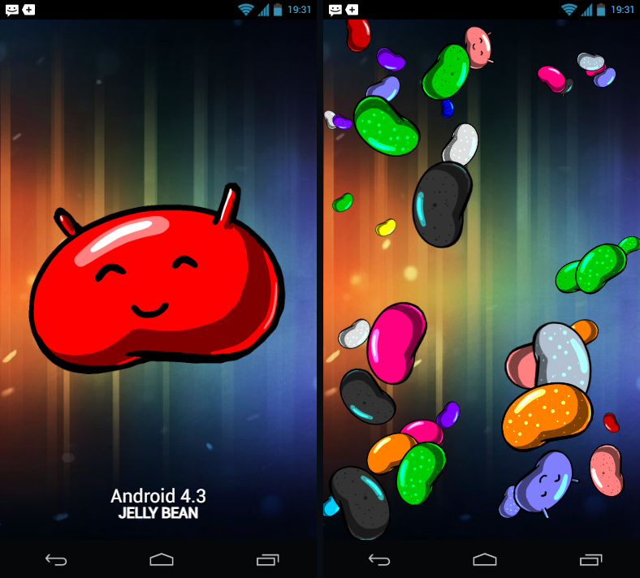
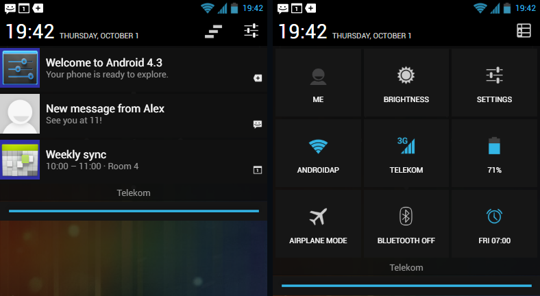
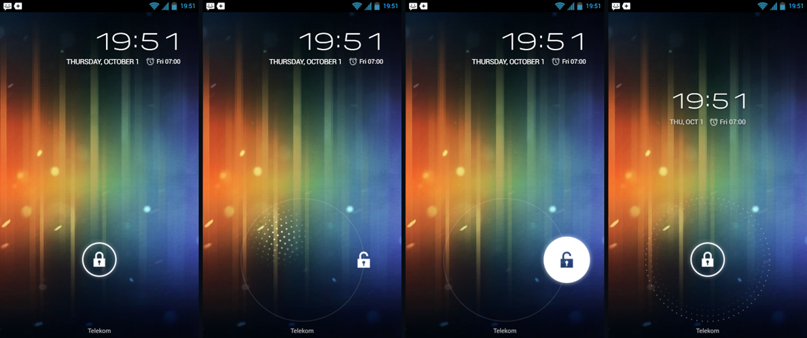
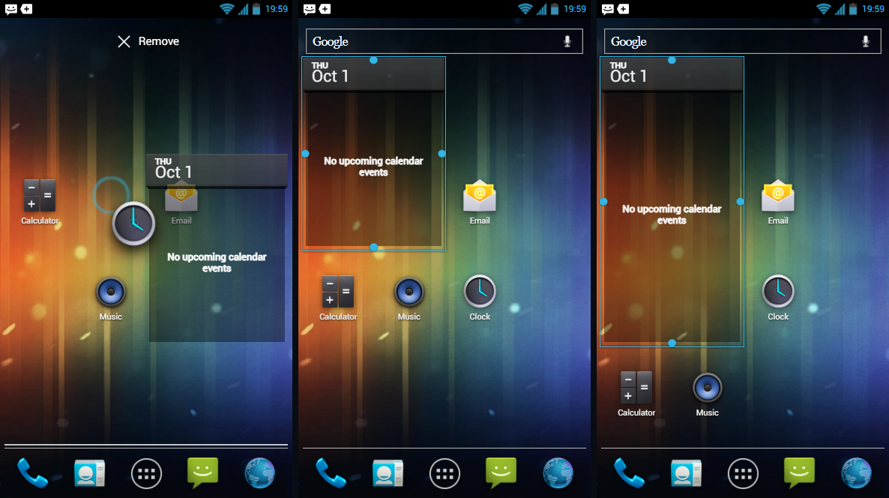
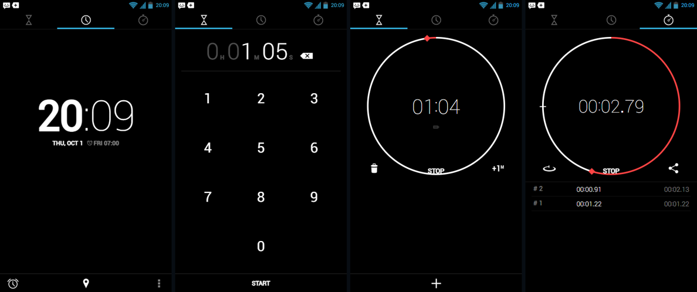
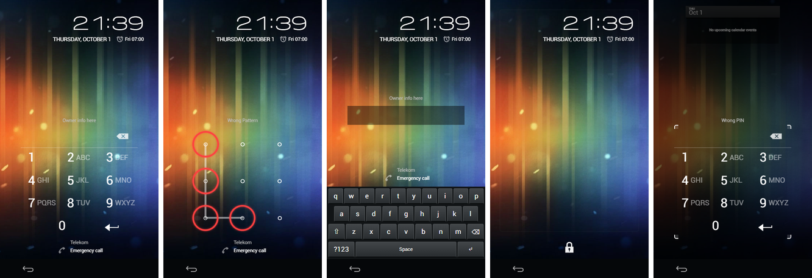
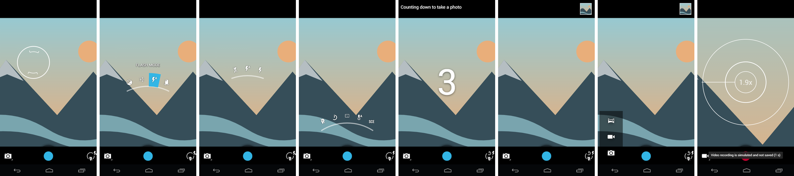
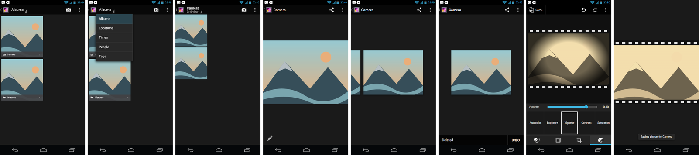
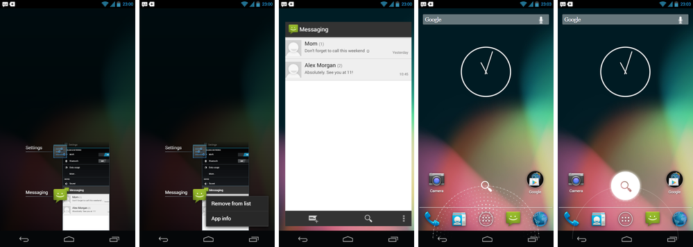

# Android 4.3 Jelly Bean audit

Target: stock **Android 4.3 on the Nexus 4 (JWR66Y)**; until 2026-10-02 the target device was the Galaxy Nexus, see the last section, AOSP tag `android-4.3_r1.1`. The simulator starts from the [Android 4.0.4 reconstruction](visual-audit.md) and replaces ICS behavior with Jelly Bean behavior screen by screen. Anything not listed here still shows the ICS implementation.

## Baseline — 2026-10-01

- Separate directory `versions/4.3/`, saved under its own browser storage key, and enabled on the landing page. The landing card uses the 4.3 directory's artwork.
- About phone: Android version 4.3, build JWR66Y. The baseband (`I9250XXLJ1`) and kernel strings are illustrative 4.3-era values.
- [DeviceInfoSettings.java](https://raw.githubusercontent.com/aosp-mirror/platform_packages_apps_settings/android-4.3_r1.1/src/com/android/settings/DeviceInfoSettings.java): Developer options are hidden until Build number is tapped seven times. Countdown toasts appear from the fourth tap, using the original `show_dev_countdown`, `show_dev_on` and `show_dev_already` strings (translated into all five languages).
- [PlatLogoActivity.java](https://raw.githubusercontent.com/aosp-mirror/platform_frameworks_base/android-4.3_r1.1/core/java/com/android/internal/app/PlatLogoActivity.java): three quick taps on Android version open `platlogo_alt` over the wallpaper. A tap swaps to `platlogo` and shows the custom toast (“Android 4.3” in Roboto Light, “JELLY BEAN” bold); a long press opens BeanBag.
- [BeanBag.java](https://raw.githubusercontent.com/aosp-mirror/platform_frameworks_base/android-4.3_r1.1/packages/SystemUI/src/com/android/systemui/BeanBag.java): 40 beans with quadratic depth (scale 0.2–1), the original bean mix and 13 colors through the same color matrix, a 0.1% candy cane, drifting and spinning, respawning at the edges. Grabbed beans follow the pointer and inherit its velocity; releasing adds spin proportional to speed. The ICS Nyandroid styles and assets were removed from the 4.3 copy.

Checks: `jb-beanbag.test.cjs` (depth, colors, drift, grab velocity, fling spin, respawn); headless Chrome: landing cards, separate storage, About values, the full Build-number toast sequence, platlogo tap/toast, long-press BeanBag with 40 beans, Back to About, and window transitions on the copy. No JavaScript errors were logged.

## Notification panel and quick settings — 2026-10-01

References: SystemUI [status_bar_expanded.xml](https://raw.githubusercontent.com/aosp-mirror/platform_frameworks_base/android-4.3_r1.1/packages/SystemUI/res/layout/status_bar_expanded.xml), [status_bar_expanded_header.xml](https://raw.githubusercontent.com/aosp-mirror/platform_frameworks_base/android-4.3_r1.1/packages/SystemUI/res/layout/status_bar_expanded_header.xml), [flip_settings.xml](https://raw.githubusercontent.com/aosp-mirror/platform_frameworks_base/android-4.3_r1.1/packages/SystemUI/res/layout/flip_settings.xml), [QuickSettings.java](https://raw.githubusercontent.com/aosp-mirror/platform_frameworks_base/android-4.3_r1.1/packages/SystemUI/src/com/android/systemui/statusbar/phone/QuickSettings.java), [QuickSettingsModel.java](https://raw.githubusercontent.com/aosp-mirror/platform_frameworks_base/android-4.3_r1.1/packages/SystemUI/src/com/android/systemui/statusbar/phone/QuickSettingsModel.java), [PhoneStatusBar.java](https://raw.githubusercontent.com/aosp-mirror/platform_frameworks_base/android-4.3_r1.1/packages/SystemUI/src/com/android/systemui/statusbar/phone/PhoneStatusBar.java), plus `dimens.xml`, `colors.xml`, `config.xml`; Calendar [AlertReceiver.java](https://raw.githubusercontent.com/aosp-mirror-neo/platform_packages_apps_calendar/android-4.3_r1.1/src/com/android/calendar/alerts/AlertReceiver.java).

- **Panel.** It wraps its content over a `#B0000000` scrim, uses the `notification_panel_bg` color (`#0e0e0e` at 90%) and the 4.3 close handle (a dark bar with the stretched holo-blue line). The 48dp black header shows the 32dp Roboto Light clock, the uppercase date, Clear all and the settings/notifications flip button.
- **Flip settings** (`config_hasFlipSettingsPanel`): the visible page squashes horizontally in 125 ms, then the other grows in 225 ms; the header buttons cross-fade. A two-finger pull opens Quick Settings directly.
- **Quick Settings.** Three columns, 110dp cells, 4dp gaps, `#161616`/`#212121` tiles, original `ic_qs_*` artwork and labels. Me opens People; Brightness opens a slider with AUTO. Settings, Wi-Fi, mobile signal, battery, Bluetooth and Alarm open the matching screens; Airplane mode toggles. Wi-Fi and Bluetooth toggle on long press (`LONG_PRESS_TOGGLES`). Alarm (next alarm) and Location (when GPS is on) tiles appear only when relevant. There is no rotation tile on phones.
- **Notifications.** The template has a 64dp large icon, 18dp title, 14dp text, time and small icon. The top notification with expanded content opens expanded; others expand with a two-finger swipe down or a trackpad pinch (Ctrl+wheel) and collapse with the opposite gesture. Calendar alerts expand to big text with **Snooze**, which re-posts after `SNOOZE_DELAY` (5 minutes).
- **Clear all.** Rows slide right in 125 ms each, starting 140 ms apart with the gap shrinking by 10 ms (minimum 50 ms); then the panel collapses.

Checks: `jb-shade.test.cjs` (clear-all timing, flip duration, tile order and states, expansion defaults, escaping). Headless Chrome: pull-down, expansion by pinch, flip and the mid-flip frame, all tiles, long-press Wi-Fi toggle, airplane mode, calendar Snooze, staggered Clear all; the touch suite passes on 4.3. No JavaScript errors.

Limits: status-bar icons are still the ICS set; Map/Call/Email-guests actions, inbox-style messaging notifications, per-app notification priority and the brightness slider's live preview mechanics are simplified.

## Keyguard: widget pager and GlowPad — 2026-10-01

References: framework [keyguard_host_view.xml (port)](https://raw.githubusercontent.com/aosp-mirror/platform_frameworks_base/android-4.3_r1.1/core/res/res/layout-port/keyguard_host_view.xml), [keyguard_glow_pad_view.xml](https://raw.githubusercontent.com/aosp-mirror/platform_frameworks_base/android-4.3_r1.1/core/res/res/layout/keyguard_glow_pad_view.xml), [keyguard_status_view.xml](https://raw.githubusercontent.com/aosp-mirror/platform_frameworks_base/android-4.3_r1.1/core/res/res/layout/keyguard_status_view.xml), [GlowPadView.java](https://raw.githubusercontent.com/aosp-mirror/platform_frameworks_base/android-4.3_r1.1/core/java/com/android/internal/widget/multiwaveview/GlowPadView.java), [PointCloud.java](https://raw.githubusercontent.com/aosp-mirror/platform_frameworks_base/android-4.3_r1.1/core/java/com/android/internal/widget/multiwaveview/PointCloud.java), [KeyguardSelectorView.java](https://raw.githubusercontent.com/aosp-mirror/platform_frameworks_base/android-4.3_r1.1/policy/src/com/android/internal/policy/impl/keyguard/KeyguardSelectorView.java), KeyguardStatusView/ClockView, and `dimens.xml`/`arrays.xml`.

- **Status widget.** The clock uses AndroidClock at 75dp, right-aligned with a 16dp margin; AM/PM is separate. The date is the locale's best weekday-month-day pattern in upper case, followed by the next alarm with `ic_lock_idle_alarm` and owner info.
- **Widget pager.** Pages follow KeyguardHostView order: the **+** slot (while fewer than five widgets), user widgets, the Music transport while Music is active, the status clock, then camera. The `kg_widget_bg_padded` frames fade in only while paging; edges resist. The add slot opens a picker with Calendar and the 4.2 DeskClock digital clock. Widgets are saved and can be removed by long-pressing and dragging to the top Remove target. Settling on the camera page opens Camera, as CameraWidgetFrame does.
- **GlowPad.** The phone keyguard uses `lockscreen_targets_unlock_only`, so dragging past the target radius minus the 40dp snap margin in any direction snaps to the single unlock target (`ic_lockscreen_unlock_activated`) with a 20 ms vibration. The PointCloud is rebuilt with the same inner/outer radii and spacing; dots use `ic_lockscreen_glowdot` with the cos¹⁰ finger glow (75dp) and cos²⁰ wave edge. On grab, the handle hides and the ring (0.5→1) and target (0.8→1) show in 200 ms after a 50 ms delay. A miss fades the glow back in 200 ms (Quart) and pings a 1350 ms Quad wave out to twice the ring radius. Keyboard Enter/Space on the handle unlocks.

Checks: `jb-keyguard.test.cjs` (cloud geometry, glow/wave alpha, page order, defaults, widget limit). Headless Chrome with mouse and with emulated touch: idle ping, grab glow, snapping, unlocking, paging to +, adding and storing a Digital clock widget, paging to camera opening Camera; the full touch suite passes on 4.3 and 4.0.4. No JavaScript errors.

Limits: pattern/PIN/password still use the ICS full-screen screens rather than SlidingChallengeLayout's bouncer and widget area; no Google Now (AOSP has no assist activity), no widget reordering, user switcher or Face Unlock; the camera page shows an icon rather than a live preview.

## Launcher: reorder and resizable widgets — 2026-10-01

References: Launcher2 4.3 [CellLayout.java](https://raw.githubusercontent.com/aosp-mirror-neo/platform_packages_apps_launcher2/android-4.3_r1.1/src/com/android/launcher2/CellLayout.java), [Workspace.java](https://raw.githubusercontent.com/aosp-mirror-neo/platform_packages_apps_launcher2/android-4.3_r1.1/src/com/android/launcher2/Workspace.java), [AppWidgetResizeFrame.java](https://raw.githubusercontent.com/aosp-mirror-neo/platform_packages_apps_launcher2/android-4.3_r1.1/src/com/android/launcher2/AppWidgetResizeFrame.java), [default_workspace.xml](https://raw.githubusercontent.com/aosp-mirror-neo/platform_packages_apps_launcher2/android-4.3_r1.1/res/xml/default_workspace.xml) (same layout as 4.0.4); provider metadata from Calendar and DeskClock 4.3 (`resizeMode`, `minResizeWidth/Height`).

- **Reorder.** Hovering a dragged icon or widget over occupied cells for `REORDER_TIMEOUT` (250 ms) computes an arrangement: occupants move to the nearest free area, preferring the direction the drag came from, and slide there in `REORDER_ANIMATION_DURATION` (150 ms). The drag outline appears once a solution exists. Moving elsewhere undoes the slide; dropping commits it. A drop before the timeout is solved immediately, as CellLayout does on drop. Within 0.55 icon widths of an icon's centre the drop still creates or fills a folder, and only then does the folder ring appear.
- **Resize frame.** Dropping a resizable widget shows the `widget_resize_frame_holo` frame with four handles. Edges snap in whole cells once a drag passes 66% of a cell (`RESIZE_THRESHOLD`), limited by the provider's minimum resize span and the grid. Shortcuts and widgets in the way move aside. Tapping elsewhere hides the frame. Resizable: Calendar (minimum 2 × 2) and the new DeskClock **Digital clock** widget (3 × 2, minimum 3 × 2); Music, Power control, Analog clock and Photo Gallery are fixed, as their 4.3 provider XML declares.

Checks: `jb-launcher.test.cjs` (item spans, nearest-free placement, own-cell reuse, multi-item widget push, impossible cases, apply, resize thresholds, folder zone). Headless Chrome: an icon displaces Music and lands in its cell; the Calendar widget pushes two icons and gets the resize frame; the bottom handle grows it to 2 × 3, moving icons. Both touch suites pass on 4.3, including folder creation by dropping on an icon centre. No JavaScript errors.

Limits: a simplified solver (Launcher's swap/push search and reorder-hint wobble are not reproduced), no cross-page reorder and no resize from keyboard.

## Clock (DeskClock 4.2/4.3) — 2026-10-01

References at DeskClock `android-4.3_r1.1`: [DeskClock.java](https://raw.githubusercontent.com/aosp-mirror-neo/platform_packages_apps_deskclock/android-4.3_r1.1/src/com/android/deskclock/DeskClock.java), [clock_fragment.xml](https://raw.githubusercontent.com/aosp-mirror-neo/platform_packages_apps_deskclock/android-4.3_r1.1/res/layout/clock_fragment.xml), [timer_fragment.xml](https://raw.githubusercontent.com/aosp-mirror-neo/platform_packages_apps_deskclock/android-4.3_r1.1/res/layout/timer_fragment.xml), [time_setup_view.xml](https://raw.githubusercontent.com/aosp-mirror-neo/platform_packages_apps_deskclock/android-4.3_r1.1/res/layout/time_setup_view.xml), [stopwatch_fragment.xml](https://raw.githubusercontent.com/aosp-mirror-neo/platform_packages_apps_deskclock/android-4.3_r1.1/res/layout/stopwatch_fragment.xml), [CircleTimerView.java](https://raw.githubusercontent.com/aosp-mirror-neo/platform_packages_apps_deskclock/android-4.3_r1.1/src/com/android/deskclock/CircleTimerView.java), plus `styles.xml`, `dimens.xml` and `colors.xml`.

- **Tabs.** A ViewPager with icon tabs (timer, clock, stopwatch) opens on Clock; tap or swipe changes pages, with the holo-blue underline.
- **Clock.** Bold hours and Roboto Thin minutes (`big_bold`/`big_thin`), the condensed uppercase date and the next alarm with `ic_alarm_small`. The footer has Alarms (opens the existing AlarmClock list and editor), Cities and the overflow menu (the last two only show a demo notice).
- **Timer.** The TimerSetupView fills H MM SS from the right; the keypad and backspace match the layout, and Start stays disabled until a duration exists. Running timers show the CircleTimerView with its rules: a 4dp white ring, `clock_red` arc drawn counter-clockwise from 12 o'clock, and the red diamond. Each has delete, Stop/Start/Reset and +1 minute; Add Timer opens the keypad again. A finished timer turns red with “Time's up”, posts a notification and switches to the Timer page. Durations use real elapsed time.
- **Stopwatch.** The counter shows hundredths in AndroidClockMono. After the first lap the red arc runs clockwise relative to that lap, with a 16dp marker at the previous lap. Lap/Reset, Start/Stop and Share are present, and Share writes the times into a new Messaging draft. The lap list is newest first.

Checks: `jb-deskclock.test.cjs` (setup digits and limits, timer state changes, formats, laps and reset, rendering). Headless Chrome: tabs, keypad 1-0-5 → 0h 01m 05s, running countdown, a 2-second timer finishing with its notification, two laps, sharing to Messaging, and swiping from Timer to Clock. No JavaScript errors.

Limits: no world-clock city list, night mode, screensaver settings, timer labels/sounds or stopwatch notification; alarms still use the ICS list and editor rather than the 4.2 time picker.

## Settings and Daydream — 2026-10-01

References: Settings 4.3 [settings_headers.xml](https://raw.githubusercontent.com/aosp-mirror/platform_packages_apps_settings/android-4.3_r1.1/res/xml/settings_headers.xml), [location_settings.xml](https://raw.githubusercontent.com/aosp-mirror/platform_packages_apps_settings/android-4.3_r1.1/res/xml/location_settings.xml), [display_settings.xml](https://raw.githubusercontent.com/aosp-mirror/platform_packages_apps_settings/android-4.3_r1.1/res/xml/display_settings.xml), [device_info_settings.xml](https://raw.githubusercontent.com/aosp-mirror/platform_packages_apps_settings/android-4.3_r1.1/res/xml/device_info_settings.xml), [security_settings_misc.xml](https://raw.githubusercontent.com/aosp-mirror/platform_packages_apps_settings/android-4.3_r1.1/res/xml/security_settings_misc.xml) and `strings.xml`; DeskClock 4.3 `desk_clock_saver.xml`.

- **Headers.** PERSONAL now starts with Location access; accounts move into their own ACCOUNTS section (Google, Add account). Users is omitted, as on single-user phones.
- **Location access.** The “Access to my location” switch enables or disables (greys out) the GPS satellites and Wi-Fi & mobile network location sources, using the original 4.3 wording.
- **Daydream.** Display has a Daydream entry after Sleep. The Daydream screen has the master switch, the off-state prompt, radio choices (Clock, Colors, Photo Frame), Start now and When to daydream (While docked / While charging / Either). Start now runs a full-screen dream that any tap ends: Clock is the dimmed DeskClock saver, which moves once a minute; Colors is a slow hue gradient; Photo Frame cross-fades Gallery pictures every six seconds.
- **Security and About.** Unknown sources uses the 4.3 summary; Verify apps (on by default) and Notification access (no listeners) are added. About phone shows SELinux status: Permissive, as on Galaxy Nexus 4.3 builds.

Checks: headless Chrome walked the header order, the location switch (greying sources and saving), Daydream off/on, dream choice, Start now with Clock and Colors, exit by tap, and About. No JavaScript errors.

Limits: dreams do not start automatically (no charging/dock state), Photo Table and Google dreams are absent, and the Colors dream approximates the GL renderer with a CSS gradient.

## Five-language and mobile sweep — 2026-10-01

Each JB-specific screen was checked in English, Hungarian, German, French and Spanish at 360×640 and 320×568 with touch emulation. The screens covered were the notification shade, quick settings flip, keyguard, clock tabs, timer keypad, stopwatch and Daydream settings. The existing app and settings sweep ran on 4.3 too. The checks were text overflow, untranslated strings, elements past the screen edge, and JavaScript errors. The earlier touch suites (long-press, drag, scroll, keyboard) also pass on 4.3.

- Pages that are not on screen in the keyguard pager and the DeskClock pager are now `inert` and `aria-hidden`. Hidden widget, camera or timer pages can no longer take focus or keyboard input.
- Known false positives:
  - French Email shows “Agenda” as a sender name.
  - At 320 px the GlowPad's invisible right-hand target box (108dp, opacity 0 at rest) sits 4 px past the edge. AOSP sizes the GlowPad in dp and crops it the same way on narrow screens.

## Secure keyguard: pattern, PIN and password — 2026-10-01

References (tag `android-4.3_r1.1`): framework [keyguard_host_view.xml (port)](https://github.com/aosp-mirror/platform_frameworks_base/blob/android-4.3_r1.1/core/res/res/layout-port/keyguard_host_view.xml), [keyguard_pattern_view.xml](https://github.com/aosp-mirror/platform_frameworks_base/blob/android-4.3_r1.1/core/res/res/layout/keyguard_pattern_view.xml), [keyguard_pin_view.xml](https://github.com/aosp-mirror/platform_frameworks_base/blob/android-4.3_r1.1/core/res/res/layout/keyguard_pin_view.xml), [keyguard_password_view.xml](https://github.com/aosp-mirror/platform_frameworks_base/blob/android-4.3_r1.1/core/res/res/layout/keyguard_password_view.xml), `keyguard_emergency_carrier_area.xml`, `keyguard_message_area.xml`, `values/dimens.xml`, `values/styles.xml`, `values/arrays.xml`; `policy/.../keyguard/` [SlidingChallengeLayout.java](https://github.com/aosp-mirror/platform_frameworks_base/blob/android-4.3_r1.1/policy/src/com/android/internal/policy/impl/keyguard/SlidingChallengeLayout.java), `KeyguardViewStateManager.java`, `KeyguardSecurityViewHelper.java`, `KeyguardMessageArea.java`, `KeyguardPatternView.java`, `KeyguardWidgetPager.java`, `KeyguardWidgetFrame.java`, `KeyguardHostView.java`, `NumPadKey.java`; `core/java/.../LockPatternView.java`.

- **Layout.** Pattern, PIN and password locks now use the 4.3 KeyguardHostView instead of the ICS screens. The widget pager (clock, user widgets, music transport, camera) stays on top, and the KeyguardSecurityContainer (320 × 400dp max, 8dp top margin) is pinned to the bottom. While it is up, the current widget shrinks to `kg_small_widget_height` (160dp).
- **Sliding.** To slide the challenge down, drag across its top edge or start above it and pull down. The 64dp expand handle (`kg_security_lock`) then fades in (250 ms, quadratic). Tapping or dragging the handle brings the challenge back. Opacity follows (offset − 1)³ + 1, and settling uses the quintic ease-out. Duration is (distance ratio + 1) × 100 ms, or 4 × distance / velocity after a fling, capped at 600 ms.
- **Paging.** With the challenge up, only swipes that start in the 24dp edge strips page the widgets, even over the challenge (`dispatchTouchEvent`). Paging fades the challenge out in 100 ms. It fades back in (160 ms) only if the page did not change; otherwise it stays down.
- **Bouncer.** Tapping a widget (calendar), the **+** page or the camera page while locked shows the bouncer:
  - a #99000000 scrim covers the pager;
  - the current page zooms to 0.67 (250 ms, decelerate 1.5);
  - the carrier/emergency area fades out;
  - the `kg_bouncer_bg_white` corner frame fades in.

  Tapping the scrim or pressing Back dismisses it. After a correct entry the pending action runs: Calendar or the event opens, the camera opens, or the widget picker appears and then the device locks again with the new widget.
- **Message area.** As in KeyguardMessageArea, the instructions (“Draw your pattern”, “Enter PIN”) are not shown. The line shows the owner info, then “Wrong Pattern / Wrong PIN / Wrong Password” for 5 seconds, or “Try again in N seconds.” during the 30-second lockout. Owner info also moved out of the clock page into the selector's message area on the slide lock.
- **Views.**
  - **Pattern:** LockPatternView inside the bouncer frame, white path at alpha 128 and 5% of a cell wide; a wrong pattern clears after 2 s.
  - **PIN:** NumPadKey rows with the “klondike” letters (ABC … WXYZ, 20dp condensed at 50% white), a password-dotted entry with `ic_input_delete`, a `#55FFFFFF` divider and `sym_keyboard_return_holo`.
  - **Password:** a #70000000 strip with 36sp text between two spacers, with the simulator keyboard below as the IME.
  - All three have the carrier line and the Emergency call button.
- **Unchanged checks.** Hashing, attempt counting and lockout are the existing simulator logic; only the surface is new.

Checks:
- `jb-challenge.test.cjs`: alpha and settle timing, fling direction, message priorities, view markup, lockout disabling, and the controller skin with a wrong and then a correct PIN.
- Headless Chrome, 390 × 760 and 320 × 568, in en/hu/de/fr/es, for all three lock types: wrong entry and message, drag down, handle visible and tap up, edge swipe to the calendar widget, tap → bouncer at 0.67 scale, then the correct code opens Calendar.
- The slide-lock GlowPad suite still passes. No JavaScript errors.

Limits:
- The camera page asks for the bouncer instead of opening the 4.2 secure camera.
- The widget frame does not track the challenge top pixel by pixel while dragging; it shows the outline and switches size when the challenge settles.
- Face Unlock, SIM PIN/PUK and the account-unlock fallback after 20 failures are not simulated.
- On short screens the challenge is capped so the clock stays visible.

## Owner-reported fixes — 2026-10-01

- **BeanBag.** Beans could not be grabbed: the global `.screen img{pointer-events:none}` rule also applied to the bean images, so touches reached the board instead. Beans now take pointer events (and `touch-action:none`). As in BeanBag.java, a held bean follows the finger. Its velocity is smoothed (0.75 old + 0.25 new), it keeps flying after release, and it spins in proportion to the release speed. Headless Chrome confirmed this with both mouse and touch.
- **Folder background and analog clock drag ghost.** The ICS fixes apply here too; see the ICS audit.

## Camera — 2026-10-01

References (Gallery2 `android-4.3_r1.1`, where the 4.3 camera lives): [layout-port/camera_controls.xml](https://github.com/aosp-mirror-neo/platform_packages_apps_gallery2/blob/android-4.3_r1.1/res/layout-port/camera_controls.xml), `switcher_popup.xml`, `menu_indicators.xml`, `count_down_to_capture.xml`, `values/dimens.xml`, `arrays.xml`, `strings.xml`, `xml/camera_preferences.xml`; [PieRenderer.java](https://github.com/aosp-mirror-neo/platform_packages_apps_gallery2/blob/android-4.3_r1.1/src/com/android/camera/ui/PieRenderer.java), `PieController.java`, `PhotoMenu.java`, `PreviewGestures.java`, `CameraSwitcher.java`, `OnScreenIndicators.java`, `ZoomRenderer.java`, `CaptureAnimManager.java`, `CameraSettings.java`, `CountDownTimerPreference.java`.

- **Controls.** At the bottom, the 72dp CameraSwitcher sits on the left with its corner mark. The ShutterButton (`btn_shutter_default`, offset −22dp) is in the middle. On the right is the PieMenuButton over the six OnScreenIndicators ring segments (scene, timer, flash, exposure, location, white balance), which follow the settings.
- **Pie menu.** Holding the preview for 200 ms opens the 4.3 arc pie at the finger; the menu button opens it in tap mode, 2.5 × 36dp above the bottom.
  - Geometry: items lie on an arc (214dp radius, centred 166dp below the touch point) 2/3 of a 48dp ring further out and 0.23 rad apart, with the white 140-alpha arc stroke under them. The arc tilts by up to 24° inside the edge zones (36 + 92dp).
  - Selection: the selected item gets the #33B5E5 annular slice, which slides between items in 80 ms, and its label appears above the arc. Hit testing uses the original slice wedges (0.14 rad around a centre 322dp below), with the 32dp touch offset while swiping. Pulling back towards the finger closes a submenu.
  - Submenus: they open after hovering for 400 ms (or at once in tap mode) one ring higher, cross-fading in 200 ms. A leaf fades out over 600 ms before its action runs; the pie fades in over 200 ms from 0.9 scale.
  - Items, left to right (PhotoMenu): Exposure (−3…+3, `EXPOSURE ±n`), More options, Flash mode (off/auto/on) and the camera switch, labelled with the camera it switches to. More options holds Location, Countdown timer, Picture size, White balance (incandescent, fluorescent, auto, daylight, cloudy) and Scene mode (action, night, none, sunset, party).
- **Popups.** Countdown timer and Picture size use the #282828 setting popup with a holo-blue title and 2dp rule. The timer steps through 0, 1, 2, 3, 4, 5, 10, 15, 20, 30 and 60 s, with “Beep during countdown”; picture sizes are the Galaxy Nexus 5M…QVGA list.
- **Focus.** A tap draws the PieRenderer focus ring at the touch point: a 72dp circle with a 3dp stroke, and an inner dial with two 45° arcs and four ticks. The dial turns from 67° by a random ±60° over 600 ms, snaps back in green in 100 ms, then hides after 200 ms.
- **Zoom.** The mouse wheel or a pinch shows the ZoomRenderer: 48dp and maximum rings, a guide line, the current ring and “x.yx”.
- **Capture.**
  - With a timer, the 160sp countdown and “Counting down to take a photo” run first; pressing the shutter again cancels.
  - CaptureAnimManager: a white flash (0.3 → 0 in 200 ms), hold to 400 ms, a decelerating slide to the 48dp thumbnail (16dp margins) by 800 ms, hold with border until 3.3 s, then a slide off to the right by 4.1 s. Tapping the thumbnail opens the photo in Gallery.
  - Swiping left on the preview also opens Gallery, standing in for the filmstrip.
- **Modules.** The switcher popup (#80000000, 0.3 → 1 scale in 200 ms) lists panorama, video and photo, with photo at the bottom.
  - Video uses the video shutter states and a red recording timer.
  - The scene-mode and fluorescent tints and the ±3 exposure range feed the illustrated preview and saved pictures.

Checks:
- `jb-camera.test.cjs`: pie tree and order, indicators, geometry symmetry, hit testing of every item in both modes, pull-to-centre, capture phases, timer values and markup.
- Headless Chrome, en at 390 × 760, hu at 320 × 568, and de/fr/es at 360 × 640, all on real mouse input:
  - tap focus;
  - hold → pie → flash → FLASH ON (setting saved, indicator updated);
  - menu button → More → Countdown timer → 3 s;
  - shutter → countdown → capture animation and thumbnail;
  - switcher → video recording;
  - wheel zoom to 1.9x;
  - swipe left to Gallery.

  No JavaScript errors.

Limits:
- Video is not saved, and panorama capture is only a message. There is no face detection, Photo Sphere or real filmstrip.
- Location and picture size are stored settings only. The countdown beep is silent.

## Status bar icons — 2026-10-01

The SystemUI `drawable-hdpi` status icons at `android-4.3_r1.1` were compared byte for byte with the ICS assets in use: `stat_sys_wifi_signal_4_fully`, `stat_sys_signal_4_fully`, `stat_sys_battery_71`, `stat_notify_more`, `stat_sys_data_bluetooth` and `stat_sys_signal_flightmode`. All six are identical, so the Jelly Bean status bar keeps them, and this roadmap item needs no new artwork.

## Window and launch animations — 2026-10-01

References (`android-4.3_r1.1`): framework `core/res/res/anim/` (`activity_*`, `task_*`, `wallpaper_*`, `lock_screen_exit.xml`, `lock_screen_wallpaper_behind_enter.xml`), [AppTransition.java](https://github.com/aosp-mirror/platform_frameworks_base/blob/android-4.3_r1.1/services/java/com/android/server/wm/AppTransition.java) (`createScaleUpAnimationLocked`, `computePivot`, thumbnail fade-out), and Launcher2 `startActivity` with `ActivityOptions.makeScaleUpAnimation`.

- **Launching from the launcher.** Home-screen, dock, folder and drawer icons now start apps the 4.1+ way: the app grows from the tapped icon's rectangle. The pivot is −start / (scale − 1), so the first frame covers the icon exactly, and the scale uses decelerate_cubic over 250 ms (the wallpaper-transit duration). Opacity rises linearly over the first quarter and then holds, and the launcher stays in place underneath.
- **Back to the launcher.** `wallpaper_open_exit`: the app fades out in 200 ms (accelerate/decelerate) while shrinking to 0.5 in 375 ms.
- **Between tasks.** The 4.3 card animation (`task_open_*` / `task_close_*`), on black:
  - The old task fades, shrinks to 0.5 towards its top and slides 120% up (300 ms, accelerating).
  - After 300 ms the new one rises from 120% below, growing from 0.5 about its bottom edge (400 ms, decelerating).
  - Closing a task mirrors the motion.
- **Inside an app.** `activity_open_*`: the new screen fades in and grows from 0.8 over 300 ms (decelerate_cubic) while the old one fades out. `activity_close_*` reverses it.
- **Unlocking.** The keyguard grows to 1.1 and fades in 200 ms, and the launcher fades in after 200 ms (`lock_screen_wallpaper_behind_enter`) instead of the ICS 0.95 zoom.
- **Unchanged.** The app drawer, folders and drag animations keep their values, because Launcher2 4.3 `config.xml` has the same zoom, fade and stagger times as 4.0.4.

Checks: `jb-transitions.test.cjs`, and headless Chrome sampling of the Messaging launch from the dock (first frame at the icon, about 0.54 × 0.48 scale with the computed pivot, about 0.69 opacity at 40 ms), Back to home, and a Settings subpage. No JavaScript errors.

Limits: notification and widget launches use the plain wallpaper/task transits rather than their own scale-up rectangles. Recents still uses the task animation instead of the 4.1+ thumbnail scale-up; that change comes with the Recents rework.

## Asset audit against 4.3 — 2026-10-01

Every inherited ICS asset in `versions/4.3/assets` was matched byte for byte to its `android-4.0.4_r2.1` source file and then compared with the same resource at `android-4.3_r1.1`. Launcher icons moved into `mipmap-*` folders, and the Phone/People icons and dialer resources moved into the Phone app. Results: 129 identical, 22 changed, 28 moved or removed, and the rest renamed project copies, which were checked individually.

Replaced with the 4.3 files:
- **Launcher icons.** Browser, Calculator, Calendar, Clock (the new 4.2 face), Email, Messaging, Settings, People (stacked cards), Phone, and Camera and Gallery (the new Gallery2 camera and picture icons).
- **Wallpapers.** The Launcher2 4.3 set `wallpaper_01…05, 08…12` (06 and 07 are tablet-only), with thumbnails from `*_small.jpg`. `wallpaper_01` is byte-identical to the framework `default_wallpaper` and is the default; the chooser shows thumbnails without names, as in 4.3.
- **Search bar.** Launcher2's `search_bar` layout is unchanged, but `search_frame.9.png` is now a filled, rounded, translucent white bar instead of the ICS outlined box. The bar uses it (nine-patch border stripped, 9 px slices) and Launcher2's own `ic_home_voice_search_holo` microphone.
- **Digital clock widget.** It was drawn in AndroidClock. It now follows DeskClock 4.3 `digital_widget_time`:
  - bold sans-serif hours and thin minutes at `widget_big_font_size` 80dp, scaled down below `def_digital_widget_width` as in `WidgetUtils.getScaleRatio`;
  - then the 14sp bold condensed uppercase date and the 50%-white next alarm with `ic_alarm_small`;
  - the drawer uses the original `appwidget_digital_clock_preview`;
  - it can shrink to 2 × 1 (`min_digital_widget_resize_*`);
  - the keyguard page uses the same layout.
- **Analog clock widget.** The 4.2 `appwidget_clock_dial/hour/minute` (thin ring and slim hands).
- **Other images and fonts.** `Roboto-Regular.ttf` and `AndroidClock.ttf` from 4.3 `data/fonts`, Calendar `ic_menu_today_holo_light`, DeskClock `ic_menu_add`, and the Mms `msg_bubble_left/right` tails.

Unchanged in 4.3 (kept): navigation bar keys, status bar icons, Settings header icons, Power widget icons and frame, holo check boxes, action bar back, overflow, the music icon and the all-apps button.

Still to review with their apps: the Calendar widget header nine-patches (removed in 4.3), Contacts' `ic_contact_picture*`, `ic_menu_*` and the dialer graphics (moved to Phone), and the in-call `ic_end_call`. These belong to the People/Phone and Calendar passes. The ICS Camera images are no longer used now that the 4.3 Camera has its own `jbcam-` set.

Limits: the “Google” label in the search bar is still project text. The real 4.3 builds draw the Google Search app's toolbar logo, which is not an AOSP asset.

## Hotseat margins — 2026-10-01

Reported by the owner: the dock had side margins and a dark gradient that are not in AOSP. Launcher2 `layout-port/launcher.xml`, `hotseat.xml` and `workspace_divider.xml` at `android-4.3_r1.1` give a full-width, transparent hotseat (`button_bar_width_left/right_padding` = 0dp). Above it sits the `dock_divider`, which uses `hotseat_track_holo.9.png`: a 2dp line of 50% white with a faint shadow, inset by `workspace_divider_padding_left/right` = 3dp. The dock now has no margin or background, and the divider is drawn from those values (2.7 px inset, 1.8 px line).

## Gallery — 2026-10-01

References (Gallery2 `android-4.3_r1.1`): `app/Config.java`, `values/dimensions.xml`, `values/colors.xml`, `ui/SlotView.java` (`WIDE = true`), `ui/AlbumLabelMaker.java`, `app/GalleryActionBar.java`, `menu/{albumset,album,photo}.xml`, `layout/photopage_bottom_controls.xml`, `ui/PositionController.java`, `ui/PhotoView.java`, `values/styles.xml` (`Holo.ActionBar` on `actionbar_translucent`), and FilterShow (`layout/filtershow_main_panel.xml`, `values/filtershow_color.xml`, `values/filtershow_strings.xml`, the `ffx_*` look names).

- **Album set.**
  - Action bar: the translucent bar (70% black) with the Gallery icon and the Holo spinner (`spinner_ab_*`), which groups by **Albums, Locations, Times, People, Tags**. Then Switch to Camera and the overflow menu.
  - Grid: slots fill 3 rows and the grid scrolls sideways, as SlotView does on phones (7dp gap and padding, square slots, #333 placeholders on #1A1A1A).
  - Labels: AlbumLabelMaker's 30dp #EE414143 strip, with the 25dp source icon (camera or folder), the 12sp #FBFBFB title and the 9sp #A9ABAD count in the last 20dp.
  - Clusters: Times groups pictures by capture day; Locations has a single “No location”; People is empty (no faces); Tags is “Untagged”.
- **Album.** Four rows of square thumbnails with 5dp gaps, also scrolling sideways. The two-line spinner shows the album name over **Grid view** and offers **Filmstrip view**. The overflow has Slideshow, Select item and Group by.
- **Photo page.**
  - Bars: the picture fills the screen. The action bar (album name, Share, overflow) and the bottom Edit button overlay it and hide after 3.5 s or on a tap; the status bar hides with them.
  - Navigation: drag sideways between pictures (16dp IMAGE_GAP). Double-tap zooms. Pinch in (or Ctrl + wheel) for **film mode**: pictures fit in 70% × 48% of the screen with the neighbours beside them; a tap opens one, and an upward fling deletes with the **Deleted / UNDO** bar.
  - From the Camera: swiping opens the newest picture with the camera preview as the card before it, and dragging back returns to the Camera.
  - Overflow (`photo.xml`): Delete, Slideshow, Edit, Rotate left/right, Crop, Set picture as and Details.
- **Photo Editor.**
  - Layout: FilterShow's Save action, the picture on #101010, the 128dp category strip and the 48dp looks/borders/geometry/colours bar on #232323.
  - Looks (Original, Punch, Vintage, B/W, Bleach, Instant, Latte, Blue, Litho, X Process) and Borders show thumbnails of the photo itself. Geometry rotates and mirrors. Colours has Autocolor, Exposure, Vignette, Contrast, Saturation and Hue sliders.
  - Undo/redo/reset are available, and holding the picture compares with the original. Leaving with changes asks “Do you want to save before exiting?”.
  - Save writes an `_edited` copy, like FilterShow, and opens it. The edits are part of the picture model, so thumbnails, wallpaper and sharing show them too.

Checks:
- `jb-gallery.test.cjs`: clusters, film and slot geometry, the back stack, markup, the editor and the SVG picture filters.
- Headless Chrome (en 390 × 760, hu 320 × 568, de/fr/es 360 × 640) with real mouse input:
  - cluster switch to Times, album, photo, swipe;
  - Ctrl + wheel into film mode (70% width), fling-up delete and UNDO, tap back to the full view;
  - photo menu, editor (Vintage, Film border, Vignette 0.8, undo, Save), back to the album;
  - camera swipe into the photo page and the drag back to the Camera.

  No JavaScript errors.

Limits:
- The grid is a scrolling HTML grid rather than the GL slot renderer, so there is no fling physics or edge glow.
- Picasa and offline albums, selection mode, crop, straighten, curves, red-eye and Tiny Planet are not simulated; Crop opens the geometry panel.
- Set picture as sets the wallpaper directly instead of offering a chooser.

## Notification panel height — 2026-10-01

The owner compared the simulator with a Nexus 4 walkthrough. In 4.3, `status_bar_expanded.xml` makes `NotificationPanelView` `wrap_content`, and `PanelView.onMeasure` lets it open only as far as its content. With no notifications it therefore stops below the header, carrier label and handle. ICS's `ExpandedView` is always full height, and the ICS simulator keeps that.

`PhoneStatusBar.flipToSettings` leaves the notification scroll view `INVISIBLE` (not `GONE`), so after flipping to Quick Settings the panel stays as tall as the larger of the notification list and the tiles. With a long list it reaches the bottom of the screen, as in the video. The simulator had removed the hidden list from the layout; it now keeps its space.

The JB easter-egg toast also gained the `toast_exit` fade (500 ms, accelerate_quad) after its `Toast.LENGTH_LONG` 3.5 s. Like any Android toast, it stays on screen for that time even after leaving the app.

## Recents and the navigation bar search panel — 2026-10-01

References (SystemUI `android-4.3_r1.1`): `layout/status_bar_recent_panel.xml`, `status_bar_recent_item.xml`, `status_bar_no_recent_apps.xml`, `drawable/status_bar_recents_background.xml`, `anim/recents_*`, `values/dimens.xml`, [RecentsPanelView.java](https://github.com/aosp-mirror/platform_frameworks_base/blob/android-4.3_r1.1/packages/SystemUI/src/com/android/systemui/recent/RecentsPanelView.java), `menu/recent_popup_menu.xml`; `layout/status_bar_search_panel.xml`, `drawable/navbar_search_outerring.xml`, `values/arrays.xml` (`navbar_search_targets`), `SearchPanelView.java`; framework `AppTransition.createThumbnailAnimationLocked` and `ic_action_assist_generic`.

- **Recents.** Since 4.1, Recents is an activity over the wallpaper rather than a panel over the app.
  - Layout: the app behind is hidden, and `status_bar_recents_background` runs from #E0000000 at the bottom to #99000000. The item layout and dimensions match ICS (88dp label, 164 × 145dp thumbnail), as in 4.3. An empty list shows “No recent apps” in 20dp holo blue.
  - Opening from an app: the app's window shrinks into the newest thumbnail and fades (thumbnail scale-down, decelerate_cubic, 250 ms) in a layer above Recents. From the launcher it fades out (`recents_launch_from_launcher_exit`).
  - The newest task's label and icon then slide in by 35dp (250 ms, DecelerateInterpolator(1.5), 150 ms delay).
  - Launching a task grows it from its thumbnail (`makeThumbnailScaleUpAnimation`).
  - A long press opens the popup with **Remove from list** and **App info**. Leaving Recents fades it out while the launcher fades in (`recents_return_to_launcher_*`).
- **Search panel.** Swiping up from the navigation bar by `navbar_search_up_threshhold` (40dp) shows the GlowPad:
  - `navbar_search_outerring` (340dp, 2dp #40FFFFFF) centred on the home key, with the point cloud following the finger and the show ping;
  - the single `ic_action_assist_generic` target at the top of the ring, which activates within the 40dp snap margin;
  - releasing on it starts search. Google builds open the Google Search app; the simulator opens Browser on Google.
- **Era text.** The Browser's offline android.com, Wikipedia and news pages, the welcome email and the App info version now describe Android 4.3 instead of 4.0.

Checks: `jb-recents.test.cjs`, and headless Chrome for the following. No JavaScript errors.
- Recents: empty list, opening from Messaging (the window mid-shrink at 90 ms), wallpaper behind, long press → popup → App info for Messaging, launching Settings from its thumbnail (scale-up with the computed pivot).
- Search panel: a swipe up that is released early (it closes and Home is not triggered), then a swipe to the target that opens Browser on www.google.com.

Limits: the Recents thumbnail cross-fade is reduced to the app scaling, and there is no landscape layout. The assist target uses the generic AOSP icon, because the Google logo variant comes from the Google Search app.

## Dialer and Calendar widget resources — 2026-10-01

- **Dialer.** In 4.3 the dialer is its own `packages/apps/Dialer`, and the in-call screen stays in Phone. The Dialer's `dial_num_*_wht`, `dial_background_texture`, action and tab icons differ in bytes from the inherited ICS files, but side by side they render the same (blue digits, grey letters, underline), so the ICS copies are kept.
- **Calendar widget.** `appwidget.xml` is unchanged apart from dropping the root's 6dip bottom padding, which the widget no longer adds. The header selector now uses `header_bg_cal_widget_normal_holo`, byte-identical to the ICS header, and `header_bg_cal_widget_pressed_holo`, a 60% holo-blue fill with the same nine-patch. The pressed header uses the 4.3 image instead of the ICS row highlight.

## Developer options — 2026-10-01

Settings 4.3 `development_prefs.xml` replaces the short ICS list.
- **Groups.** The top group (Desktop backup password, Stay awake, HDCP checking, Protect USB storage), then Debugging, Input, Drawing, Hardware accelerated rendering, Monitoring and Apps, 34 rows with the 4.3 titles and summaries.
- **Master switch.** The DevelopmentSettings ON/OFF switch sits in the action bar; turning it off greys every row and removes the overlays. Wait for debugger stays disabled because no debug app is set, as on the device.
- **Working rows.**
  - Show touches (existing), Window/Transition animation scale (driving the 4.3 window animations) and the new Animator duration scale dialog.
  - **Show layout bounds** outlines every view's bounds.
  - **Pointer location** draws PointerLocationView's top bar with P / X / Y / Prs / Size in device pixels.
  - **Show CPU usage** shows the LoadAverageService panel (load averages and per-process bars).
- **Stored only.** The other check boxes are saved, and the list rows show their 4.3 summaries.

## Full five-language mobile sweep — 2026-10-01

Every app root and Settings sub-page (31 screens) was swept in en/hu/de/fr/es at 360 × 640 and 320 × 568, with 2× DPR mobile emulation. The JB-specific screens were swept the same way:
- shade and Quick Settings, keyguard, Clock tabs, Daydream;
- Camera: pie, More options, switcher;
- Gallery: set, clusters, album, mode spinner, photo, menu, every editor panel, slider and the unsaved-changes dialog;
- Recents with its popup, and the secure PIN keyguard.

Checks covered text overflow, untranslated text and labels, elements past the screen edge, broken images and JavaScript errors.

- Fixed: the Recents popup menu ran 17–19 px past the right edge on 320 px screens; it now shifts left to stay on screen, as PopupMenu does.
- Known false positives:
  - The Camera's on-screen indicator ring has `layout_marginRight="-5dip"` in AOSP and overhangs the edge by about 5 px.
  - The GlowPad target box overhangs at 320 px (see the earlier sweep).
  - The editor's category strip and the Gallery grids scroll sideways by design.
  - French Email's “Agenda” is a sender name.
- A first parallel run with 15 browsers also hit page-load timeouts in the scripts; rerunning at lower concurrency was clean.

## Password keyboard — 2026-10-01

The letter keyboard of the password lock and the password setup now draws LatinIME's `KeyboardView.IceCreamSandwich` theme. Its holo resources are byte-identical in `android-4.0.4_r2.1` and `android-4.3_r1.1` ([LatinIME java/res](https://github.com/aosp-mirror-neo/platform_packages_inputmethods_latinime/tree/android-4.3_r1.1/java/res)).
- **Keys.** `btn_keyboard_key_light_*_holo` letter keys and `btn_keyboard_key_dark_*_holo` functional keys (nine-patch borders removed), on the `keyboard_background_holo` gradient. The `sym_keyboard_{shift,shift_locked,delete,space,return}_holo` icons replace the text glyphs.
- **Proportions.** `keyboardHeight` 205.6dp, top/bottom padding 2.335%/4.669%, horizontal gap 1.739% and bottom gap 6.127%. Letters are bold at 55% of the key height; ?123 uses the 34% label size.
- **Layout.** The second row is inset by half a key. The bottom row is ?123, comma, space, period and Enter, with Shift and Delete at 1.5× width.

The PIN pads keep their own framework (ICS) or Keyguard (4.3) keys, as on the device.

## Settings sub-pages against 4.3 XML — 2026-10-01

Each sub-page was compared with the 4.3 preference XML (`sound_settings`, `display_settings`, `language_settings`, `accessibility_settings`, `date_time_prefs`, `privacy_settings`, `wireless_settings`), skipping rows the Galaxy Nexus hides (Dock, Wireless display, 4G, Emergency tone).
- **Sound.** No Silent mode row (since 4.1 it lives on the volume keys and in the power menu). Music effects is added, the category is CALL RINGTONE & VIBRATE with **Vibrate when ringing**, and the SYSTEM group starts with **Default notification sound**.
- **Language & input.**
  - Language opens its own radio list (it switches the simulator language) and Spell checker follows.
  - KEYBOARD & INPUT METHODS: Default and Android keyboard (AOSP).
  - SPEECH: Voice search and Text-to-speech output.
  - MOUSE/TRACKPAD: Pointer speed.
- **Accessibility.** Magnification gestures, Large text, Power button ends call, Auto-rotate screen, Speak passwords, Accessibility shortcut, Text-to-speech output and Touch & hold delay, in 4.3 order and without the ICS summaries.
- **Smaller fixes.** Date & time says **Choose date format**. Backup & reset gains **Backup account**. *More…* drops Wi-Fi Direct, which 4.3 moved into the Wi-Fi menu.

## Dialer smart dial — 2026-10-02

The 4.3 Dialer (`packages/apps/Dialer` at `android-4.3_r1.1`, `dialpad_fragment.xml`, `SmartDialNameMatcher`, `SmartDialAdapter`) differs from the ICS Contacts dialpad:
- **Smart dial row.** Between the digits and the keypad, a 50sp row shows three contact suggestions. Names match when the typed digits spell the start of a word, possibly running on into the starts of the following words (so "26" finds **A**lex **M**organ). Accented letters are folded first, as `remapAccentedChar` does. Numbers match by prefix, with or without the country code. The best match sits in the middle slot, the second on the left and the third on the right; matched characters are highlighted. Tapping a suggestion calls it.
- **Action bar.** Search and the overflow moved from the bottom row into the end of the tab bar (`dialtacts_options.xml`), so the bottom is a single full-width call button with the 4.3 `btn_call_pressed` state.

## Power menu, shutdown and boot — 2026-10-02

Compared with `GlobalActions.java`, `ShutdownThread.java`, `global_actions_item.xml`, `global_actions_silent_mode.xml`, `alert_dialog_holo.xml`, `progress_dialog_holo.xml`, `safe_mode.xml` and `cmds/bootanimation/BootAnimation.cpp` at `android-4.3_r1.1`. The same `global-actions.js` serves 4.0.4 with the 4.1+ parts switched off.
- **Opening.** Hold the power key for 500 ms (`getGlobalActionKeyTimeout`). With the screen off, the hold only wakes it, as in `PhoneWindowManager`.
- **Rows.** Power off; Airplane mode with its ON/OFF status; Bug report (only when *Power menu bug reports* is on); and the three-cell ringer row.
  - Row sizes: 64dp rows, 56dp icon box, 22sp and 14sp text.
  - The ringer row has 64dp cells; the selected one carries the `tab_selected_holo` bar. A choice closes the menu after `DIALOG_DISMISS_DELAY` (300 ms).
  - The ringer mode is the Sound settings' silent mode, now shown in the status bar as `stat_sys_ringer_{vibrate,silent}`. The status bar also gained `stat_sys_alarm`, placed after Bluetooth and the volume icon, as in `config_statusBarIcons`.
- **Dialog.** `dialog_full_holo_dark` at 95% width with 8dp side insets. It is dimmed 0.6, but the status and navigation bars stay bright because they sit above the keyguard dialog layer.
- **Power off.** Cancel / OK confirmation ("Your phone will shut down."), then the "Shutting down…" progress dialog with the 48dp holo spinner and a 500 ms vibration, then a black screen.
- **Safe mode and bug report.** A long press on Power off asks to reboot to safe mode. After the reboot, the *Safe mode* watermark (`#80ffffff` on `#60000000`) sits at the bottom left over the navigation bar. Bug report asks to Take bug report and, a few seconds later, posts "Bug report captured".
- **Boot.** Pressing power while off plays BootAnimation's `android()` loop: `android-logo-shine` scrolls 4 px per 16.667 ms behind `android-logo-mask`, redrawn at 12 fps and drawn at its pixel size. The phone then comes up at the lock screen with Recents cleared.

## Volume panel — 2026-10-02

Compared with `VolumePanel.java`, `volume_adjust.xml` and `volume_adjust_item.xml`, and the volume rules in `AudioService.java`, at `android-4.3_r1.1` (4.0.4 behaves the same on a phone).
- **Size.** Both layouts are inflated with a null root, so the 480dp width and the 80dp item height are dropped. The panel spans the portrait width, 80dp from the top (`volume_panel_top`), in `dialog_full_holo_dark`. Its one row is wrap_content: the 32dp stream icon with 16dp padding, then the holo SeekBar with 16dp padding and a 16dp end margin, 64dp in all.
- **Single slider.** A voice-capable phone has no expand button (`mShowCombinedVolumes` is false). The slider is for the active stream (`getActiveStreamType`): the call, otherwise music while it plays, otherwise the ringer. The maximums are 5, 15 and 7 steps (`MAX_STREAM_VOLUME`).
- **Ringer mode** (`checkForRingerModeChange`, device with a vibrator).
  - Lowering from the last audible step enters vibrate, with the 300 ms vibration after the 300 ms `VIBRATE_DELAY`.
  - Another lower reaches silent only if the previous key was not a lower, so repeated presses stop at vibrate.
  - Raising goes silent → vibrate → normal.
  - While muted, the slider is disabled at 0, the track is drawn at the 0.5 disabled alpha, and the icon shows `ic_audio_ring_notif_vibrate` or `_mute`.
- **Timing.** The panel has no enter animation and fades out over 400 ms. It closes 3 s after the last change (`TIMEOUT_DELAY`) or on a touch outside (`FLAG_WATCH_OUTSIDE_TOUCH`), which still reaches the window underneath.
- **Keys.**
  - Held keys repeat after 500 ms, every 50 ms.
  - With the screen off, the keys change only music that is playing, without showing the panel.
  - The volume buttons sit in the header next to power; on the desktop frame, the side rocker works too.
- **Assets.** 4.0.4 and 4.3 each use their own scrubber artwork; the 4.3 thumb and track differ from ICS.

## Launcher clings — 2026-10-02

Compared with Launcher2 `Cling.java`, `Launcher.java` (`initCling`, `dismissCling`, `showFirstRun*Cling`), `AppsCustomizePagedView.showAllAppsCling`, `Folder.animateOpen`, and the `workspace_cling`, `all_apps_cling` and `folder_cling` layouts at `android-4.3_r1.1`. They are identical in 4.0.4 apart from where the reveal radius comes from; both are 48dp.
- **Workspace.** On a first run, `bg_cling1` covers the launcher at once.
  - It has a 48dp hole at the all apps button, with `cling.png` scaled by 48/94 (`clingPunchThroughGraphicCenterRadius`) around it.
  - Text: "Make yourself at home" 90dp from the top, "To see all your apps, touch the circle." 130dp above the bottom, and OK at the bottom end.
  - Touches inside the hole reach the button. Opening all apps dismisses this cling.
- **All apps.** Opening the drawer fades in `bg_cling2` over 550 ms (accelerate). Its hole is on the app in cell (1, 1) (`apps_customize_cling_focused_x/y`), and `hand.png` sits `app_icon_size / 4` below and right of the hole's centre.
- **Folder.** `bg_cling3` fades in once the folder's open animation ends. Touches inside the folder pass through, and closing the folder dismisses it (`Launcher.closeFolder`).
- **Common rules.** OK fades a cling out over 250 ms and records it, as the shared preferences do.
  - Desktops saved before this change count as already dismissed; Reset brings the clings back, like a fresh install.
  - Text styles follow `ClingTitleText` (23sp `#49C0EC`) and `ClingText` (15sp white, 2px shadow). `ClingButton` is bold on `btn_cling_normal`.

## Wi-Fi settings — 2026-10-02

Compared with `WifiSettings.java`, `AdvancedWifiSettings.java`, `wifi_advanced_settings.xml`, `WpsDialog.java`, `wifi_wps_dialog.xml` and `WifiP2pSettings.java` at `android-4.3_r1.1`, and the tuna overlay (`config_wifi_dual_band_support` is true).
- **Action bar.** After the switch come WPS Push Button (`ic_wps`) and Add network (`ic_menu_add`), both `SHOW_AS_ACTION_IF_ROOM`. The overflow holds Scan, WPS Pin Entry, Wi-Fi Direct and Advanced. All but Advanced are disabled while Wi-Fi is off.
- **WPS dialog.**
  - It opens on "Starting WPS…", then shows the push-button or PIN text (8-digit PIN), with the `ic_wps` symbol.
  - The holo horizontal timeout bar advances once a second to `WPS_TIMEOUT_S` (120). After that, the generic failure message remains and the button reads OK.
  - The button is a centred holo default button.
- **Wi-Fi Direct.** Wi-Fi Direct moved from *More…* into this menu in 4.2. Its page lists this device (`Android_4f3a`, renamable through Rename device) above PEER DEVICES. Search for devices shows "Searching…" for a while when the page opens and whenever it is pressed. With no peers simulated, the category stays empty.
- **Advanced Wi-Fi rows.**
  - Network notification (disabled while Wi-Fi is off) and Keep Wi-Fi on during sleep.
  - **Scanning always available** (new in 4.3, off) and **Avoid poor connections** (off).
  - **Wi-Fi frequency band**: Auto / 5 GHz only / 2.4 GHz only, with the choice shown as the summary.
  - **Install certificates** and **Wi-Fi optimization** (on).
  - MAC address and IP address.

## People and Calculator against 4.3 — 2026-10-02

The Contacts trees at `android-4.0.4_r2.1` and `android-4.3_r1.1`, and ContactsCommon 4.3, were compared through their git blob hashes.
- **Contact pictures.** `ic_contact_picture*` moved to ContactsCommon unchanged (identical blobs), so the inherited files stay.
- **Detail header.** `detail_header_contact_without_updates` keeps ProportionalLayout's 2:1 photo; the simulator's fixed 200px header now follows the ratio. Below the photo it adds the 10dp `windowContentOverlay` shadow (`ab_solid_shadow_holo`).
- **Groups list.** `group_browse_list_fragment` pads the list by 16dp on each side.
- **Calculator.** `main.xml` now lets CLR/DELETE wrap its text with an 89dip minimum, instead of a quarter of the row. The button's text is AOSP's `del` string "DELETE"; it had shown "DEL", also in 4.0.4.

## Messaging, Browser, Email, Calendar and Music resources — 2026-10-02

The trees at `android-4.0.4_r2.1` and `android-4.3_r1.1` were compared by blob hash, and every `mms-`, `browser-`, `calendar-`, `email-` and `music-` asset in `versions/4.3/assets` was hashed against the 4.3 files.
- **Assets and unchanged apps.** All prefixed assets are the 4.3 files; the music widget nine-patches are the expected border-stripped copies. Music is unchanged between the two releases. Email's changes are in tablet and setup layouts.
- **Messaging** (`message_list_item_recv/send`, `compose_message_activity`).
  - Message blocks draw `hairline_left` or `hairline_right`: white, with a 1px `#eeeeee` line along the bottom and the outer edge.
  - The thread background is the theme's `background_holo_light` instead of `list_background` `#f1f1f1`.
  - The editor divider is 1dp `#eeeeee`.
  - The send button switches to `ic_send_disabled_holo_light` while there is nothing to send (`send_button_selector`).
  - Dates use `text_hairline` `#cccccc`, as in 4.0.4, where the simulator also had them darker. In 4.0.4 a disabled send button no longer fades, since ICS has no disabled image.
- **Browser.** The phone title bar (`title_bar_nav`) changes only in RTL attributes; `tab_bar` is tablet-only, and the Quick Controls lab radii and colours do not apply.
- **Calendar** (4.2 redesign, the parts the simulator draws).
  - The action bar's Today button is the blank `ic_menu_today_holo_light` with a `DayOfMonthDrawable` on top: today's date in 14sp bold `#777`, centred, baseline at (height + text height + 1) / 2.
  - Event details use `EventInfoFragment` in `FULL_WINDOW_STYLE` on phones, so the headline's Edit/Delete buttons are gone. Edit (`ic_menu_compose_holo_light`) and Delete (`ic_menu_trash_holo_light`) sit in the action bar (`event_info_title_bar`).
  - The coloured `event_info_headline` follows its 8/16/16dp padding, with a 24sp bold title, one 14sp when-line (`Utils.getDisplayedDatetime`: the date, then ", start – end"), the repeat line at 70% white, and the location.

## Live wallpapers — 2026-10-02

The tuna `device.mk` builds `LiveWallpapers`, `LiveWallpapersPicker` and `VisualizationWallpapers`. `packages/wallpapers/Basic` (Nexus, Grass, Galaxy, Water, Polar clock) and LivePicker are identical at `android-4.0.4_r2.1` and `android-4.3_r1.1`, so both versions share `live-wallpapers.js`.
- **Picker.** "Live Wallpapers" joins Gallery and Wallpapers in the chooser, sorted by label.
  - `LiveWallpaperActivity` uses Theme.Holo without a title. Its list rows (`live_wallpaper_entry`) have a 75dp centre-cropped thumbnail and an 18sp title, sorted with a Collator in the current language.
  - `LiveWallpaperPreview` shows the running wallpaper above a `#88000000` bar with Settings… (only where a settings activity exists) and Set wallpaper.
  - Polar clock's settings page has Show seconds, Vary ring widths and the eight colour palettes.
- **Engines.** Each runs only while visible (home, keyguard or preview), at its script's frame delay (Nexus and Galaxy 45 ms, Grass and Water 50 ms, Polar clock 40 ms with seconds, otherwise 2 s). Each takes the workspace scroll as its x offset.
  - **Nexus** (`nexus.rs`): 20 pulses plus 40 tap pulses on a 14px grid, at 0.2 px/ms × a 0.7–1.7 speed scale. Trails are 40 cells long with a 64px glow head, coloured red, green, blue or yellow at 0.8 alpha and added (SRC_ALPHA, ONE) over `pyramid_background` stretched across two screens. A tap sends four pulses out of its cell.
  - **Polar clock**: round-capped arcs for seconds, minutes, hours, day and month. Ring widths are 8, 16, 32, 16 and 32px with 14px and 38px gaps, starting at 12 o'clock. The centre moves with the offset (`lerp(s, -s, offset)`). Palettes come from `polar_clock_palettes.xml`; the default is the dynamic white one.
  - **Grass** (`grass.rs`): 200 tessellated blades over twice the screen width.
    - Perlin turbulence (`turbulencef2`, four octaves) bends them up to 0.09.
    - The sky is night, sunrise, noon or sunset: dawn at 6:00 with two hours of sunrise, dusk at 18:00 with two hours of sunset. Blades are HSB greens dimmed to black at night.
    - The preview runs a whole day every 30 seconds. The night sky keeps drawNight's vertical mirror.
  - **Galaxy** (`galaxy.rs`, WebGL): 12000 point sprites.
    - Distances follow a Gaussian; colours, point sizes and speeds are as in `createParticle`. The shader twists them by `dist × 5.5` into a 0.892 ellipse.
    - The normalized-projection matrix, `calcMatrix` tilt and turn by the page offset (`angle` 50°, 0° in the preview), additive flares and the `light1` core are all replicated.
  - **Water** (`fall.rs`, WebGL): a 48-column mesh samples `pond.jpg` through ten ripple drops, using the vertex shader's `addDrop`. 14 leaves drift and spin from the 8-sprite `leaves.png`, with shadows while they fall in. Leaves and taps start ripples.
- **Music visualizations** (`VisualizationWallpapers`; vis1 is commented out in its manifest).
  - **Waveform** (vis2): 1024 PCM samples as a `fire.png` band, a triangle strip of ±amplitude. It turns 180° per page of offset, scaled by `0.004165 × (1 + 2|sin|)`.
  - **Spectrum** (vis3): `ice.png`, 360° per page. The FFT power is weighted by `i / 16 + 1`, falls by at most 800 per update, wraps as a short and is spread across 720 columns.
  - **VU meter** (vis4): the meter images (blended ONE / ONE_MINUS_SRC_ALPHA). The needle follows the rectified signal through `Visualization4RS`'s coil, spring and friction model (mass 10, spring 200) and lights the peak lamp past 33333.
  - **Many** (vis5): six alternating wave and meter panels revolve at 0.3° per 35 ms, plus up to ±45° from the page offset, with a −20° tilt. They are mirrored below an album-art floor, which is drawn with the last meter's matrix still loaded, as in `many.rs`.
  - **Idle state.** As in `AudioCapture`, more than 3 s of silence returns no data, and the scripts run `makeIdleWave` with the fade-out (100 frames) and fade-in (15) between idle and live data.
  - **Audio source.** The simulator has no audio output, so while Music plays a synthetic 120 bpm mix (kick, saw bass, square lead, hi-hat, noise floor) stands in for the Visualizer capture: 8-bit PCM, and an FFT in getFft's byte layout.

## Sweep of the new screens — 2026-10-02

Headless Chrome at 360 × 640 and 320 × 568, in en, hu, de, fr and es, for 4.0.4 and 4.3. It covered:
- the three clings;
- the power menu and Power off confirmation (and Bug report in 4.3), and the volume panel;
- in 4.3, the Wi-Fi page, overflow, WPS dialog, Wi-Fi Direct with its menu and rename dialog, Advanced Wi-Fi and the frequency-band list (4.0.4 has the Wi-Fi page and overflow only);
- the live wallpaper list, the Polar clock preview, its settings and the palette list.

Checks covered page overflow, elements past the screen edge, text overflow, broken images and untranslated text or labels. Nothing was found apart from the known French Calendar label "Agenda" (Calendar's name in French), which appears in the all-apps and folder clings.

## Device: Nexus 4 — 2026-10-02

The 4.3 version moved from the Galaxy Nexus to the **Nexus 4** (LG E960, `mako`), which shipped with 4.2 and received 4.3 as JWR66Y. With this change each version runs on its own Nexus: Nexus S for 2.3, Galaxy Nexus for 4.0, Nexus 4 for 4.3, Nexus 5 for 4.4 and Nexus 6 for 5.1. Compared with `device/lge/mako` at `android-4.3_r1.1` (`device.mk`, the framework, SystemUI and SettingsProvider overlays).
- **Front.** A flat black glass slab (68.7 × 133.9 mm) with a 4.7" 768 × 1280 (5:3) panel, shown at 327 × 545 px instead of 306 × 545. It has a silver rim and the earpiece slot at the top centre, with the front camera to its right and the proximity/light sensor to its left ([iFixit teardown](https://www.ifixit.com/Teardown/Nexus+4+Teardown/11781)). Volume is on the left, power on the right.
- **Notification LED** (`config_intrusiveNotificationLed`). It sits hidden under the glass below the display. With Pulse notification light on, pending notifications pulse it white (`config_defaultNotificationColor`) for 1000 ms every 10 s while the screen is off.
- **Wireless display** (`config_enableWifiDisplay` is true on mako).
  - Display settings gain Wireless display (Off / On / Disabled while Wi-Fi is off), after Pulse notification light as in `display_settings.xml`.
  - `WifiDisplaySettings` has the action-bar switch, the "To see devices…" or "disabled because Wi-Fi is off" messages, and AVAILABLE DEVICES with its scanning spinner. No display is simulated, so the scan ends with "No nearby wireless displays were found."
  - Quick Settings show the Wireless Display tile only while the feature is on (`setShowWhenEnabled`), opening those settings.
- **Mobile data** (`config_hspa_data_distinguishable`): the status bar shows `stat_sys_data_fully_connected_h` when mobile data carries the connection, and the Quick Settings signal tile uses the H overlay.
- **Camera HDR.** The mako camera supports the `hdr` scene mode, so `PhotoMenu` puts the HDR switch first in the pie (`ic_hdr` / `ic_hdr_off`). Turning it on resets the scene mode to auto, and a non-auto scene turns it off (`onSettingChanged`). The scene indicator shows `ic_indicator_sce_hdr`.
- **About phone** (factory JWR66Y). Model number "Nexus 4", baseband `M9615A-CEFWMAZM-2.0.1700.84`, and kernel `3.4.0-perf-gf43c3d9`, built Mon Jun 17 16:55:05 PDT 2013 ([YobiWiki](https://wiki.yobi.be/index.php/Android_phones)). The default Bluetooth name is "Nexus 4".
- **Unchanged.** The live wallpapers, dual-band Wi-Fi and the rest of the build list are the same as on tuna. The live wallpapers now scale their device-pixel sizes from the 768px panel.
- **Checks.** The five-language desktop sweep at 1280 × 900 (327 × 545 screen) found only the known camera-indicator overhang and the French "Agenda". The new screens are untranslated-free in hu/de/fr/es.

## Device frames redrawn — 2026-10-02

Both handsets are now SVG drawings (`versions/4.0.4/assets/device-galaxy-nexus.svg`, `versions/4.3/assets/device-nexus-4.svg`) instead of CSS shapes. Their outlines were traced from front renders on Wikimedia Commons ([Samsung Galaxy Nexus render](https://commons.wikimedia.org/wiki/File:Samsung_Galaxy_Nexus_Render.png), [Nexus 4](https://commons.wikimedia.org/wiki/File:Nexus_4.png)). Only the outline is traced: the alpha mask, with the side keys cut off, smoothed into a path. The rim, glass, glare, grille, sensors, camera and keys are drawn by `docs/device-frames.py`, and no photo is used.
- **Galaxy Nexus.** The Contour Display silhouette, with arched top and bottom edges and the curved chin, under a metallic rim. The grille sits at the top centre, with the two sensors and the camera to its right. Power is on the right and the volume rocker on the left, at their measured heights. The display window is 306 × 545, the 720 × 1280 panel at 0.425.
- **Nexus 4.** Rounded corners and gently arched edges under a dark grey rim. The earpiece sits in its recess below the rim at the top centre, with the two sensors on the left and the camera on the right. The display window is 327 × 545, the 768 × 1280 panel at 0.426. The notification LED is still hidden below the display.
- **Landing cards.** The miniatures use the same drawings.

## Google Play Store 4.2.3 (July 2013) — 2026-10-02

The 4.3 store was the shared fictional 2012-style storefront (`play-store.js`). It is now Google Play Store 4.2.3, the version in the Android 4.3 system image that reached the Nexus 4 in July 2013 (`jb-play.js`, `jb-play.css`). 4.2.9 rolled out the same week with only widget changes. The navigation drawer only came with 4.4 in the autumn, so the action bar overflow leads to My apps, My wishlist, Redeem, Settings and Help.

References: Android Police captures of 4.0.25 (9 April 2013), 4.1.6 (14 May 2013) and 4.2.3 (18 July 2013); the owner's 4.2.3 home and Settings capture. Colours and sizes were sampled from the captures, using 1 dp = 0.8516 px.

- **Action bar:** 48 dp; #666 at the top level and in Settings, the section colour inside sections. It has the up caret, the white Play glyph (the bag with the triangle cut out), search, share on details, and the overflow.
- **Home:**
  - The six category buttons (Apps / Games / Movies & TV / Music / Books / Magazines) are 40 dp tall in a 2 × 3 grid, each with its white icon. The right-hand square of each button is split by its diagonals into a light top, a lighter right and a slightly darker bottom.
  - Card clusters have Roboto Light Italic titles, grey subtitles and the SEE MORE button in the section colour.
  - Below them are the pink "Get Unlimited Music / Try All Access for Free" promo, Recommended for You and Free classics.
- **Cards:** white with a 1 dp shadow, the art (app icons inset), title (two lines), creator, stars and the price in the section colour (or INSTALLED), and the overflow dots. The overflow popup offers Add to wishlist (Remove from wishlist) and Buy $x / Install.
- **Sections:** the light tab strip (Bold 12 dp uppercase, the current tab underlined 4 dp in the section colour; it scrolls and can be swiped) with CATEGORIES, HOME (clusters) and numbered top lists ("1. Title", creator, stars, price / INSTALLED / ✔ PURCHASED).
- **Details:** the white header with the big icon, Light title, upper-case creator, and either INSTALL / the price in the section colour or OPEN + UNINSTALL in grey.
  - Below come the screenshots, the facts (rating, date, downloads, size), +1, Rate & review with five stars (a rating is stored), What's new, Description, and Reviews with the coloured histogram.
  - Install opens the 4.0 permissions dialog with the green ACCEPT, then the inline download bar with its cancel X.
- **My apps:** INSTALLED / ALL tabs and the italic "Up to date" group with the count. **My wishlist:** a card grid, or "Your wishlist is empty."
- **Settings (Holo Light):** GENERAL (Notifications, Auto-update apps, Auto-add widgets, Clear search history), USER CONTROLS (Content filtering, Password) and ABOUT (Open source licenses, Build version 4.2.3).
  - Auto-update apps is the 4.x list preference: Do not auto-update / at any time / over Wi-Fi only.
- **Icon:** the 2012–2014 Google Play bag (official file, see the notices).

Checks: `tests/jb-play.test.cjs` covers the version, category order, clusters, the promo, Hungarian labels, the section bar colour and tabs, numbered lists, details states (install, price, open / uninstall, progress), the permissions, card and auto-update dialogs, My apps, the wishlist, Settings and the overflow menu. Headless Chrome covered home, Apps HOME / TOP FREE, the card popup, details, install → download → installed, My apps, Settings and the auto-update dialog. No JavaScript errors.

## Notification panel overpull (rubberbanding) — 2026-10-02

Owner's note: in period videos the 4.3 panel can be pulled all the way down even when it is empty. `PanelView.setExpandedHeightInternal` (android-4.3_r1) only clamps the height to the content (`fh`) when not `mRubberbandingEnabled && (mTracking || mRubberbanding)`. Rubberbanding is on by default, and PhoneStatusBar never turns it off. So while the finger is down, the panel follows it past its content to the bottom of the screen. The `notification_panel_bg`, the carrier label and the handle stretch with it. On release the panel springs back to its content height: for an empty panel, the header, the carrier label and the handle.

The simulator used to stop the drag at the content height. It now lets the drag run to the screen bottom and animates back on release. `.jb-shade-pages` grows so the stretched panel has no gap.

## Status bar signal cluster spacing — 2026-10-02

Owner's note: the Wi-Fi icon sat closer to the alarm icon than to the signal bars. AOSP `status_bar.xml` gives `signal_battery_cluster` a 2 dp start padding. `signal_cluster_view.xml` gives the `wifi_combo` `layout_marginEnd="-6dp"`, so the mobile signal tucks under the right of the Wi-Fi fan: the fan is wide at the top, the bars at the bottom. The simulator had neither. The Wi-Fi, data type and signal icons now sit in a `.status-cluster` with 2 px start padding, and the Wi-Fi icon has a -6 px end margin (status icons are drawn at 1 dp = 1 px). This applies to both 4.0.4 and 4.3.

## Notification panel height (owner feedback)

A Nexus 4 review frame (Android 4.2 Quick Settings) shows the expanded panel at the top of the screen over the status bar, reaching down to the navigation bar. The panel now opens that far and stays open when released. The carrier label and the handle sit at its bottom.

The browser demo pages are now dated to 2013 ("2013 Web", a Nexus 4 / Jelly Bean article from July 24, 2013), and KitKat (announced September 2013) is gone from the Wikipedia version list.

## Interface strings from the factory image — 2026-10-04

The shared `i18n.js` rows are hand-written and address the user informally in Hungarian ("Rajzold le…"). The Nexus 4 JWR66Y image addresses the user formally ("Rajzolja le a mintát a feloldáshoz"), and it often words the German, French and Spanish texts differently too. `docs/image-strings.mjs 4.3` writes `versions/4.3/image-strings.js` (372 rows), which overrides the shared rows with the image's own text. The text comes from the image's `strings-index.json`, built by `docs/image-index.py`.

A row is only taken from the APKs whose screens quote it. The calendar view, for example, only reads CalendarGoogle and the framework. When those APKs translate the text in more than one way, the row stays as it was unless `PIN` names the resource. `docs/image-strings-4.3.tsv` lists every change and every skip. Settings header rows are upper-cased, like the list separators (`textAllCaps`). The in-call Mute button reads Phone's `onscreenMuteText` ("Lezárás" in Hungarian, as in the image) through a context row: `i18n.t(text, 'Phone')`. Settings' silent-mode choice keeps the shared "Némítás".

## First-boot defaults from the image — 2026-10-04

The Nexus 4 image's SettingsProvider (`defaults.xml` as compiled) was read, together with the framework config:

- Screen timeout 30 s, touch / screen-lock / dial-pad sounds on, vibrate on touch on, notification light on: these already matched.
- Automatic brightness: on (`def_screen_brightness_automatic_mode`). It was off in the simulator.
- Daydream: on (`config_dreamsEnabledByDefault`). It starts while docked (`config_dreamsActivatedOnDockByDefault` true, `…OnSleepByDefault` false), and the Clock is the default dream (`config_dreamsDefaultComponent` = DeskClock Screensaver). The simulator had Daydream off and set to "While charging".
- The image's default brightness (87 of 255) is not applied: the simulator's brightness only dims the page.

## Calendar date and time pickers (audit step 2) — 2026-10-05

The Calendar editor had browser date and time fields, and on 4.3 and 4.4 a Previous / Next bar of its own. CalendarGoogle in JWR66Y and KTU84P, and Google Calendar 5.0 in LMY48Y, use AOSP's `frameworks/opt/datetimepicker` (their APKs carry `date_picker_dialog.xml` and `time_picker_dialog.xml`). `dtp.js` / `dtp.css` rebuild it from each APK's resources, generated by `docs/datetimepicker.py` from `docs/datetimepicker.template.js`:
- **Date:**
  - the #999999 day-of-week header over month / day / year, with the active part in #33b5e5 and the rest in #999999;
  - the 270 dp month grid: #999999 days, today in blue, the selected day on a blue circle at alpha 60; it turns with the wheel or a drag;
  - the year list, opening on the selected year;
  - Done.
- **Time:**
  - the 96 dp header (hours : minutes in 60 sp, the active one blue; AM / PM);
  - RadialPickerLayout on #f2f2f2:
    - a white circle with the numbers at the resources' multipliers;
    - on a 24-hour clock, 12–11 outside and 00, 13–23 inside;
    - the blue selector line and circle, and the AM / PM circles;
  - hours first, then minutes, then Done.

The editor's From / To rows (`edit_event_1.xml`) are Holo spinner buttons ("Mon, Oct 5, 2026" and the time) on 4.3 and 4.4, and the `edit_segment_when.xml` date and end-aligned time on 5.1.1. Setting the start moves the end so the event keeps its length. The bottom bar is gone: views move with a swipe, and Today jumps back.

## People editor (audit step 3) — 2026-10-05

The contact editor was a fixed form (name / phone / email / company / notes). It is now the image's ContactEditorFragment for the phone-only account (`contact-editor.js`, generated by `docs/holo-contact-editor.py` from `docs/holo-contact-editor.template.js` with that image's Contacts and framework texts):
- **Header:** "Phone-only, unsynced contact" on #eeeeee.
- **Name:** given / family name, with the expander for prefix, middle name and suffix.
- **Photo:** the 48 dp photo with Take photo (a new picture in the Gallery), Choose photo from Gallery and Remove photo.
- **Phone and Email sections:**
  - each row has its 100 dp type spinner (Mobile, Home, Work, Work Fax, Home Fax, Pager, Other, Custom → a label), the remove button and "Add new";
  - "Add another field" offers Address, IM, Organization, Notes, Nickname, Website and Internet call.
- **Action bar:** DONE with `ic_menu_done_holo_*`, and Discard.
- **Detail view:** lists every phone with its type and its own Call and Message buttons, every email, and the other fields. The star is `btn_star_on/off_normal_holo_dark`, and a contact photo shows in the list and the detail view.
- **Saving:** the first phone and email stay the contact's `phone` / `email`, so Phone and Messaging keep working.

## AOSP Music menus (audit step 3) — 2026-10-05

AOSP Music (kept beside Play Music) had controls of the simulator's own: a "Demo tracks — no audio" note and a "Music library" button in the player, ⋮ buttons on every song, a "＋ New playlist" row and a ‹ back button. It now behaves like `packages/apps/Music` at this release:
- **Context menus:** a long press (or right click) on a song opens Play, Add to playlist, (Remove from playlist), Use as phone ringtone, Delete and Search. Artists and albums get Play, Add to playlist, Delete and Search; playlists get Play and Delete.
- **Options menu:** the app targets API 9, so SystemUI shows the legacy menu key (`ic_sysbar_menu`) at the navigation bar's right end.
  - The library's options are Party shuffle and Shuffle all.
  - The player's options are Library, Party shuffle, Add to playlist, Use as phone ringtone and Delete.
- **Playlists:** the list starts with Recently added.
- **Use as phone ringtone:** sets the ringtone and toasts the app's `"%s" set as phone ringtone.`
- **Delete:** asks with `delete_song_desc` and removes the song from the lists.

The texts come from AOSP Music at the version's tag (`music-strings.js`, `docs/aosp-music-strings.py`). The demo songs stay silent, without a note on the phone.

## Google apps checked against the JWR66Y APKs (audit step 4) — 2026-10-05

`stock-strings.js` (`docs/stock-strings.py` from `docs/stock-strings.json`) carries each app's own texts as the image translates them, and the bars show the framework's up caret only when there is a way up.
- **Keep 1.0.81:**
  - `browse_fragment_menu.xml` has no action icons. The overflow holds Single-column / Multi-column view, Refresh, Archived notes, Settings, Send feedback and Help.
  - `quick_edit.xml` spans the width: "Add quick note", a divider, and `add_items_bar.xml` with New note, New list, New recording and New photo.
  - Notes sit on `note_shadow` in two columns or one. "Take a note" shows when there are none.
  - The editor has Note color and New photo in the bar. Archive / Unarchive, Delete, Show checkboxes, Share, Settings, Send feedback and Help are in its overflow, and Archive works.
- **YouTube 4.5.17:**
  - The bar is `bg_stripes_dark` with `ic_logo_wide` and no title (it was a light bar titled "What to Watch"). Search sits in the bar; Settings, Feedback and Help in the overflow.
  - The Feed (`the_feed_video_item.xml`): the channel's avatar and name over the full-width thumbnail with its gradient, white title and underlined duration.
  - The watch page has Add to and Share in the bar, and Like, Dislike, Copy URL and Flag in the overflow (the page's own Like / Share buttons are gone).
- **Maps 6.14.4:**
  - Search, Directions, Places (opens Local) and Layers in the bar (`map_view_default.xml`, `ic_menu_*` from `drawable-320dpi-v14`); Clear map, My Places, Settings and Help in the overflow.
  - The Maps title opens the feature switcher: Map, Local, GPS navigation, Traffic.
  - Layers toggles Traffic, Satellite, Terrain and Bicycling, and offers Clear map.
  - My Location (`btn_myl_normal`) is on the map, with the zoom controls. "Make available offline" is not included: its title is not a resource in the APK.
- **Google+ 4.0:**
  - `host_action_bar.xml` on the light bar: `ic_gplus_red_32`, the Home stream with its subtitle, the notification count (`notification_count`: #dd4b39, white bold number) and the overflow.
  - The overflow is `host_menu.xml`'s stream items: New post, Share photos, Share your location, Refresh, Send feedback, Settings, Help, Sign out.
  - `compose_bar.xml` at the bottom: Photo, Check in, Mood and Write in their colours on black. Posts reshare with `ic_reshare_16`.
- **Earth 7.1.1:**
  - Theme.Earth's overlay action bar on `header_bar_bg_80_percent_black` over the globe, replacing the white search box and the "‹" home button.
  - `menu-v11/main.xml` as `EarthActivity.onCreateOptionsMenu` shows it on phones: every item except the sensors button and Fly to; Clear map only once there is something to clear (after a search).
  - The framework's `max_action_buttons` is 3 at 360 dp and up, and `ActionMenuPresenter` keeps one slot for the overflow. So Search (always, expands with "Example: Pizza") and Reset to north are in the bar. My location, Share, Settings, Feedback, Help and Tutorial go to the overflow (the first version had My location and a sensors toggle in the bar).
- **Google Search 2.5.9 (Google Now):**
  - The Google app showed the KitKat launcher's Google Now page (`gel-now.js`, a drawn header and a bottom bar of Reminders / Customize / Menu). It is now `velvet-now.js` from `velvet_main.xml`.
  - The header is Velvet's own picture for the time of day (`context_header_bg_dawn` / `_daylight` / `_dusk` / `_twilight`) with `ic_google_large_light`.
  - `search_plate.xml` on `search_bg` straddles the picture's edge: the "g", "Search…" and the microphone (opens Voice Search).
  - The cards on #e5e5e5 use `card_background` with Velvet's text styles: the weather card (`weather_card.xml`: the big temperature, wind, precipitation, the week grid) and the next appointment (`next_appointment_card.xml`).
  - `footer_fragment.xml`: "Show more cards…" and the menu button with Settings, Send feedback and Help. Settings now opens the Search settings, which the Google Settings app's "Search & Now" row did not do on 4.3 before.
- **Voice Search (Google Search 2.5.9):**
  - The screen was a centred red circle on white. It is now `speak_now.xml`: a `search_bg` panel 260 dp tall on #e5e5e5 with `ic_google_medium_dark`, the recognizer at the top right and "Speak now" in 20 sp sans-serif-light.
  - The recognizer: `vs_micbtn_rec` over `vs_reactive_light` while listening, with `vs_levels_guideline`; after a timeout, `vs_micbtn_on` and the image's `no_match` text.
- **News & Weather 1.3.11 (GenieWidget):**
  - The action bar is GenieWidget's ActionBar style (#222222), with Refresh in the bar and Settings in the overflow.
  - The tabs are the app's own 52 dp TabView: 12 sp, a 6 dp blue bottom on the selected tab, #505050 lines and separators. They are no longer Holo's uppercase tabs.
  - News rows are `news_item_layout.xml`: 80 dp, 16 sp bold title, 14 sp grey snippet, a 70 dp picture on the right instead of the full-width photo.
  - The Weather tab is `weather_current_view.xml` in `bg_weather_panel_app`: the city with the info button, the APK's `ic_weather_*` icons, today's 80 sp temperature, high / low, conditions, humidity and wind in its own strings, The Weather Channel's logo, and the forecast days with the app's one-letter day names.
- **Google Settings (Google Play services, PrebuiltGmsCore):**
  - The app's own 48 dp bar (`common_settings_bg`, the icon, "Google Settings" in 18 sp) over a list with 16 dp margins.
  - The rows come from `GoogleSettingsActivity.e()` in the APK's dex, in its unsorted order: Apps with Google+ Sign-In, Google+, Location, Search, Ads, Verify apps. Play Games only shows with the Games app, which the image lacks.
  - The rows are `simple_list_item_1` at 18 sp. The list had KitKat-era rows (Android Device Manager, Search & Now) under a SERVICES header.
  - `docs/stock-strings.py` now reads APKs the string index skips (PrebuiltGmsCore) through aapt2.
- **Broken lengths:** 44 declarations in 4.3's chrome, hangouts, extra apps, email, Play apps and stock apps CSS read `.851.6px`, plus `.8.46px` and `.2.82px` left over from rescaling KitKat's values. The browser dropped them, so borders, shadows and paddings were missing. They are now `.85px` (1 dp), `.85px` and `.28px`, and `tests/css-numbers.test.cjs` guards all versions.
- **Play Books 2.8.91 (Books.apk):**
  - The app had Play Books 3's look (Android Police, October 2013): a drawn glyph, "Read Now" with a SEE ALL chip and bare covers. 2.8 is what the image ships.
  - The action bar is `StyleUtils.configureFlatBlueActionBar` as `BooksActivity` calls it: `action_bar_bg_books` (#3f9fe0 over a 2 dp #3689c0 line), the drawer toggle's `ic_drawer_white`, `ic_corpora_books` and the view's title.
  - `menu/home.xml`: Search is always in the bar (`ic_menu_search_dark`); Sort (only in My Library, `HomeMenuFragment.maybeUpdateMenu`), Refresh, Settings and Help are in the overflow, a Holo.Light popup (`menu_dropdown_panel_holo_light`).
  - The side drawer is `HomeFragment.createSideDrawerItems`: Read Now, My Library, Shop, in `side_menu_list_item` rows (64 dp, 21 sp sans-serif-light #505050) on #fafafa, the current one on #25000000. The drawer and its scrim were drawn at the top of the screen, because `--sb` is not set in 4.3; they now sit under the action bar.
  - Read Now is `read_now_header` ("Recent", 21 sp light italic) over `books_card_small` cards (`card_bg_play`, 16 sp light title, 13 sp #b5b5b5 author, `ic_menu_moreoverflow_card_dark_normal`).
  - My Library is `my_library_header`'s filter spinner (`LibraryFilter`: All books and Purchases; Uploads and Samples stay hidden while empty) over `my_library_divider` (2 dp #3f9fe0).
  - The reader's bar is ReadingActivityDay's `ab_solid_light_holo` with `ic_ab_back_holo_light` and `ic_corpora_books_color` instead of the "‹" caret.
  - Test: `tests/jb-play-apps.test.cjs`.
- **Play Movies 2.5.4 (Videos.apk):**
  - The app had the white-card look of Play Movies 3 with a drawer. 2.5.4 is a Holo dark app on `striped_background_red` (a 16 dp tile) without a drawer.
  - `HomeActivityCompat$V11`: the black ActionBar (`actionbar_background`) with the app icon and "Google Play"; on a phone in portrait the verticals are action bar tabs on #4d1d1d (`actionbar_background_stacked`; `actionbar_tab_background`'s 6 dp #c74b46 under the selected tab, white and #989898 text): Movies, TV shows, Personal videos.
  - The menus in the order `HomeActivity.onCreateOptionsMenu` adds them: `common_menu` (Settings, Help, Contact us, Send feedback; GoogleFeedback is on the image), `home_menu` (Refresh, Accounts), then Search (always) and Shop (ifRoom) only on the store verticals. The overflow is a dark Holo popup.
  - Movies is `MoviesOutlineHelper`'s outline: panel headings (`Panel_Header`, 21 dp sans-serif-light), `PurchasedMovieItemView` rows (a 120 dp poster at 0.694 for a 368 dp row, `video_item_style_widths`; the 21 dp title, "year, %1$s mins." from `item_joiner` in #cccccc; the download pin), Suggestions and `suggestions_footer` (`ic_menu_shop_holo_dark`, "See more from Google Play", `ic_chevron_right`). TV shows lists My shows; Personal videos shows `no_local_videos_found`.
  - The player's "‹" is `ic_ab_back_holo_dark` with the app icon.
- **Play Music 5.0.1042J (Music2.apk):**
  - The image ships Music2.apk without code; the classes come from `/system/app/Music2.odex` in the system image (Dalvik `dey 036`; the dexopt class flags have to be cleared before dexdump reads it).
  - The layout was already close (it followed a Play Music 5 review), but drew its own glyphs and KitKat's text. `MusicActionBar` now uses `action_bar_bg_music` (#f4842d over a 2 dp #d27127 line), `ic_drawer_white` / `ic_ab_back_holo_dark`, `ic_corpora_music_white`, and `home_action_bar_spinner_item`'s subtitle ("All music", 10 sp bold #b3ffffff, not "ALL MUSIC").
  - `menu/home_activity.xml`: Search (always, `ic_search_white`), then Refresh music, Settings and Help in the overflow (a Holo.Light popup).
  - The drawer is `HomeMenu.FREE_ITEM_SCREENS` (no All Access on the demo account): Listen Now, My Library, Playlists, Instant Mixes and Shop, in `side_menu_list_item` rows. Instant Mixes is `InstantMixesFragment`'s My mixes / Recommended tabs.
  - My Library's tabs are `MyLibraryFragment`'s Genres, Artists, Albums, Songs (in mixed case) on `PlayTabStrip`: `play_checker_tile`, 12 sp bold #505050 with 24 dp padding, the 8 dp selected underline, a 2 dp #26000000 line and #19000000 separators.
  - The cards use `card_bg_play`, `PlayCardTitle` (16 sp light #505050) and `PlayCardSubtitle` (13 sp #b5b5b5) with `ic_menu_moreoverflow_card_dark_normal`; the reasons are the APK's `reason_recently_played` / `reason_recently_added`.
- **Navigation (Maps 6.14's DestinationActivity):**
  - The screen was a white list with drawn icons. On a phone with SDK 14+ `DestinationActivity.onCreate` uses `da_destination_activity_redesign`: Theme.Holo on black, the #222222 action bar (`da_DestinationPickerActionBarStyle`) with `ic_navigation`, and a ViewPager whose PagerTitleStrip shows SHORTCUTS and STARRED (12 sp #33b5e5 on the #2e2e2e–#3c3c3c gradient).
  - The shortcuts page has class `aa`'s tiles (`DestinationActivityTileButton`): Speak destination, Type destination, Contacts, Starred places, each 100 dp on `da_action_button_normal` with the 320 dpi `da_picker_*` icon over 13 sp #cccccc text. The texts come from the stock-strings index.
- **Local (Maps 6.14's Places, `placesv2.xml`):**
  - The white list with drawn pins is now `places2_wizard_header` (`actionbar_background`, the feature switcher with `ic_feature_local` and `switcher_dropdown_triangle`, "Local" in 22 sp, `actionbar_search`) and `places2_location_selector` (`places_location_bar_bg` with `gray_location`, the place in 16 sp white, `locationbar_triangle`).
  - The categories sit on `places_categories_bg` (#c7d5e6 with `places_categories_map` at the bottom) in `places2_category_line` rows of four `places2_wizard_item` tiles: the 54 dp `places_cat_icon_*` and a 12 sp black caption.
  - Maps 6.14 keeps most texts outside its Android resources, so the place name is the simulator's demo location (Mountain View).
- **Messenger (Google+ 4.0's `ConversationListActivity`):**
  - `HostedMessengerFragment.onPrepareActionBar` shows "Messenger" (`home_screen_huddle_label`) in the light host bar with the New conversation action button (`ic_menu_start_new_huddle`). The overflow has the host menu's common items (Send feedback, Settings, Help, Sign out).
  - Rows are `conversation_list_item_view`: the 64 dp avatar (`ic_avatar`), the 18 sp bold #303030 name, the 12 sp #c0c0c0 time and the 14 sp #707070 last message, on `bg_tacos_body` cards over #e5e5e5. They replace the drawn person icons.
- **Currents 2.1.1 (Currents.apk):**
  - The app showed Currents 1's edition tiles. 2.1's `currents_home_activity` is a sliding story panel on #f1f1f1 over the `CurrentsHomeCategoryMenu` (#555555): special rows (Breaking stories, Saved; 18 dp #b2b2b2, the selected one on #0099cb), the editions (14 dp white on #4c4c4c with their icons) and the italic Customize row. The home button slides the panel aside.
  - The bar shows the category as `currents_home_action_bar_list_item` (18 dp #707070). The story tiles use the APK's tile text styles: 19 dp light black titles, 14 dp #8d8d8d bylines, 14 dp #777777 bodies. The stories are made up.
  - The overflow is `currents_home_menu` as the home shows it: Search, Sync now, Settings, Help.
- **Play Magazines 2.0.0 (Magazines.apk):**
  - `BaseTheme.Magazines.Light.PurpleActionBar`: `action_bar_bg_mag` (#5161bc over a 2 dp #4653a1 line) with `ic_drawer_white`, `ic_corpora_tile_magazines` and the white title, instead of the Holo tabs.
  - `home_nav_drawer`: Read Now, My Library, Shop (64 dp, 21 sp sans-serif-light #505050, #e1e1e1 dividers, the current one on #e6e6e6). Shop opens the Play Store.
  - `magazines_home_menu`: Search magazines as the bar icon; Refresh, On device only, Manage subscriptions, Settings and Help in the overflow.
  - The home grid uses `TitleNextWidget` cards (`card_bg_play`, 14 sp bold #333333 title, 13 sp #aaaaaa issue, the card overflow) in 140 dp columns on #e6e7e7.
