# Android 4.0.4 visual and behavior audit

Initial audit: 2026-09-28. Latest follow-up: 2026-09-30. Target: stock **Android 4.0.4 / Galaxy Nexus**, using AOSP tag `android-4.0.4_r2.1` and the historical screenshots supplied by the project owner. Nexus 4 / Android 4.2 references are not the target.

**Result: the simulator is not yet a complete, visually faithful ICS reproduction.** The system shell has received substantial source-based corrections. The app reconstructions and their remaining limits are recorded below. Launching successfully is not evidence of visual fidelity.

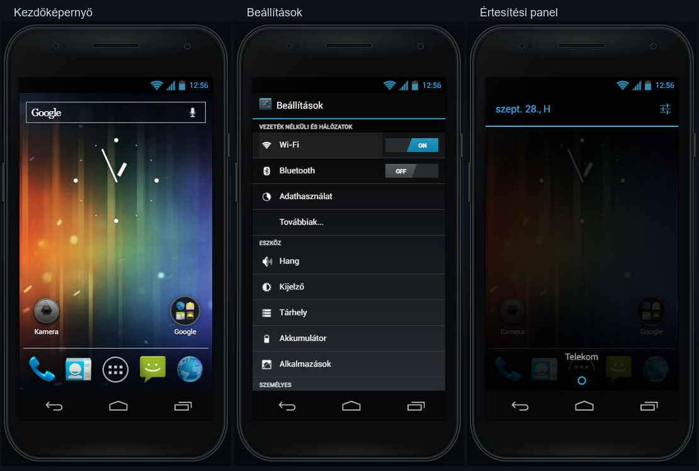

## Corrected in this audit

| Area | Evidence and changes | Remaining limits |
| --- | --- | --- |
| Settings background | Uses the original framework `background_holo_dark.png`, fixed behind the scrolling list. The action bar remains at the top. Settings previews in Recents also receive this background. | Font sizes, row heights and dialogs are browser approximations, not a pixel-exact Android density rendering. |
| Settings controls | Original Holo checkboxes, Settings/up icons and Bluetooth device artwork replace improvised symbols. Wi-Fi/Bluetooth retain the single-piece, one-sided-slant switch thumb from the previous fix. | Switch shape is CSS; exact Android pressed/disabled animations are not reproduced. |
| Wi-Fi | Header switch and overflow menu, scan/add/advanced actions, connected network ordering, network-strength icons, connecting/forgetting and saved custom SSIDs. Passwords are discarded. | Networks and security are simulated; scanning does not use hardware. Advanced settings remain limited. |
| Bluetooth | Header switch/menu, device name and visibility row, original phone/headset/config icons, discovery, pairing confirmation, unpairing, renaming and empty received-file list. | One paired device is stored. Visibility has no original timeout selector/countdown. No real Bluetooth or file transfer. |
| Notification shade | A single status bar stays above the shade. Header/date/actions, dark notification rows, carrier label and original close-handle artwork added. Tracking background uses AOSP ARGB `#d8000000`, equivalent to CSS `#000000d8`: 216/255 opacity, approximately 85%. Dragging follows the pointer; notifications move sideways before removal. Clearing the last notification closes the panel. | Expansion/fling timing, icon tint and shadows remain approximate. Telekom is a dummy carrier; airplane mode uses localized “No service.”, not a complete SIM-state model. |
| Home screens | Fixed icon auto-placement: all 16 cells now have explicit coordinates, so widgets cannot shift shortcuts into implicit rows. Five adjacent pages move in a continuous horizontal track. The Home button returns to page 2 (the third page). The five persistent dots were replaced by a temporary thin page marker. User-created folders are supported; see the folder follow-up below. | No live wallpaper engine, Android drag-outline feedback or automatic neighboring-icon rearrangement. |
| Default workspace | AOSP layout: blank page 0; Power control on page 1; analog clock and Camera on page 2; Gallery and Settings on page 3; blank page 4. Google folder retained from the supplied Galaxy Nexus photo. | The Google folder is an explicit Google/Nexus-style addition to the AOSP base. Its contents are limited to simulated apps. |
| Widgets | Actual DeskClock dial and hand images; minute/hour positions update. Working Power control uses original icons, frame and indicators. Grid collision detection supports 2×2, 2×3 and 4×1 spans. Widgets preserve the grab offset when moving; edge hovering changes pages. | Calendar, Music and Photo frame contents are functional browser approximations. There are no resize handles or per-widget configuration screens. Old customized digital/weather widgets are preserved for compatibility but are no longer offered as stock widgets. |
| Shortcut dragging | Fixed the stale drawer selector that prevented dragging an app to the desktop. Dropping onto another shortcut creates a folder; dropping onto a folder adds a shortcut without overwriting its contents. Mouse long-press and vertical dragging work; fast horizontal gestures page the workspace. | Drop and reorder animations approximate Launcher2; nested folders are unsupported, as in the original. |
| App drawer | Labels are sorted in the selected language. Original app icons, Apps/Widgets tabs, 4×5 app grid, widget span labels and two widget pages. | There are 13 apps including the Play demo, so Apps has one page. Widget previews and drawer transitions remain approximations; Apps paging across multiple pages has not been exercised. |
| Recents | Existing swipe movement checked. Returning to a recent app restores its subpage and outer scroll position. Empty panel dismisses on tap. | Previews are scaled DOM copies, not Android screenshots; nested scroll positions and every app's state are not fully captured. |
| Lock screen | Corrected to camera on the **left**, unlock on the **right**, matching the framework target array. A tap shows the targets without unlocking. Carrier text matches the shade. Pattern/PIN/Password demo modes are now supported; see the credential-screen follow-up. | Ripple/target animations, music controls, Face Unlock and account recovery remain incomplete. |
| Easter egg and toast | Original toast frame resource replaces the improvised translucent rounded panel. Android-version activation is three taps within 500 ms, as in `DeviceInfoSettings.java`. Original platlogo/Nyandroid artwork remains. | Nyandroid motion/hold timing is a browser approximation. Long-press animation was not reverified in this audit's browser input tests. |
| Languages and landing preview | New labels translated into EN/HU/DE/FR/ES. Calendar uses locale-specific month/weekdays and local dates. Landing-page clock now uses the same original images as the launcher. CSS/JS cache versions advanced. | Sample messages, mail, contacts and offline pages contain English demo content. This is not a complete import of Android's translation resources. |

Existing user-customized desktops are preserved. Only an exact match for the previous untouched demo layout is migrated to the corrected default. Legacy saved widgets retain their previous spans so the update does not silently enlarge them over shortcuts.

## Application interiors: reconstruction status and remaining limits

Every listed app was opened in the browser and checked for missing images, horizontal overflow and console errors. These checks passed. Visual inspection found the following gaps:

| App | Current mismatch / next required work |
| --- | --- |
| Phone | Dialpad now uses original key images, texture, tabs and bottom actions with the source 20/65/15 proportions. Search, add-to-contact handoff and persistent outgoing call log work. Favorites tiles, log details and the in-call screen now have a source-based reconstruction (see Phone follow-up); voicemail, pause/wait dialing and full call settings are not implemented. |
| People | Replaced with source-informed lists, tabs and photo header; see the People and Browser section below. Favorites now use photo tiles; custom contact photos, multi-value fields and account synchronization remain incomplete. |
| Messaging | Reconstructed from the Mms layouts; see the Messaging section below. Browser typography, menus and attachment selection remain approximations; no group messages, delivery reports or Android keyboard. |
| Browser | Phone toolbar and tab/library controls reconstructed; see below. Tab previews now render inert scaled copies of the bundled page content; the web content remains fictional. |
| Camera | Original control artwork and full-screen layout now used, with local capture/settings; see Camera/Gallery follow-up. Preview is an illustration; video, panorama and hardware behavior remain absent. |
| Gallery | Dark albums, grid, filmstrip and photo menus now implemented; see follow-up. Crop/editor, multi-selection, Picasa and exact OpenGL animations remain absent. |
| Clock | Reconstructed clock face, alarm list and preferences; see the DeskClock follow-up below. Sound/vibration playback, full alarm settings and background/closed-tab delivery remain unimplemented. |
| Calendar | Reconstructed light action bar, four views, local event editor and details; see Calendar follow-up. Recurrence, reminder delivery and account sync remain absent. |
| Calculator | Rebuilt basic and advanced portrait panels from original XML, including original key frames, DEL/CLR row and display proportions. Drag paging, menu switching, expression precedence, radians, powers, factorials, roots, keyboard deletion and persisted history work. Numeric precision uses JavaScript with 12 significant digits rather than the original Arity engine; history navigation uses keyboard Up/Down rather than the Android display gesture. |
| Music | AOSP library, queue and player reconstructed; see Music follow-up. Widget artwork remains an approximation. |
| Email | Light Email list/reader/composer reconstructed; see Email follow-up. Accounts, server sync and HTML mail remain absent. |
| Settings detail pages | Sound/display dialogs, usage/storage/battery drill-downs and app management added; see Settings detail follow-up. Security, accessibility, date/time, VPN and hotspot setup still have omissions. Baseband/kernel values remain illustrative. |

The seven-tap Build-number Developer-options unlock is retained **at the owner's explicit request**. Stock ICS exposes Developer options by default; hiding it behind Build-number taps belongs to later Android releases.

## Phone and Calculator follow-up

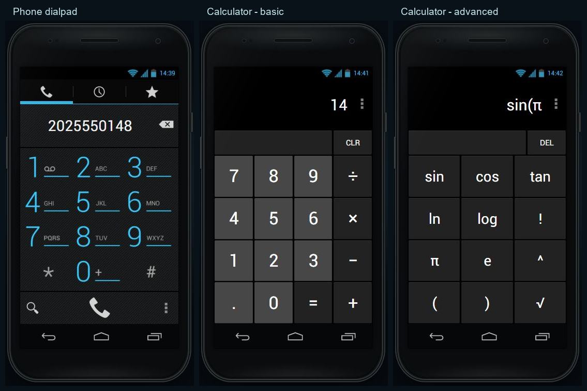

The follow-up uses the [Contacts dialpad layout](https://android.googlesource.com/platform/packages/apps/Contacts/+/refs/tags/android-4.0.4_r2.1/res/layout/dialpad.xml), [dialpad dimensions](https://android.googlesource.com/platform/packages/apps/Contacts/+/refs/tags/android-4.0.4_r2.1/res/values/dimens.xml), and Calculator's [portrait main layout](https://android.googlesource.com/platform/packages/apps/Calculator/+/refs/tags/android-4.0.4_r2.1/res/layout-port/main.xml), [basic pad](https://android.googlesource.com/platform/packages/apps/Calculator/+/refs/tags/android-4.0.4_r2.1/res/layout-port/simple_pad.xml), [advanced pad](https://android.googlesource.com/platform/packages/apps/Calculator/+/refs/tags/android-4.0.4_r2.1/res/layout-port/advanced_pad.xml) and [styles](https://android.googlesource.com/platform/packages/apps/Calculator/+/refs/tags/android-4.0.4_r2.1/res/values/styles.xml).

Verified in the browser: entering a phone number, ending a simulated call, history persistence across reload, formatted-number contact matching, returning a history number to the pad, and searching contacts. Calculator: `2+3×4=14`, dragging to the advanced panel, `sin(π÷2)=1` with an omitted closing parenthesis, Back returning to the basic panel, Backspace deleting rather than exiting, and Up recalling the last expression. The Calculator menu was also checked in all five languages with no horizontal overflow, and the add-to-contact editor handoff was exercised. No captured JavaScript errors. The isolated evaluator tests cover 19 valid expressions and 8 invalid inputs.

## Browser verification performed

- Opened all 12 app roots: no broken image, horizontal overflow or captured JavaScript error.
- Dragged between home pages; Home returned to the center page.
- Toggled Wi-Fi through Power control and verified persistence after reload.
- Dragged a drawer shortcut onto a free home cell and verified persistence.
- Moved the analog clock down one grid row and verified its saved coordinates after reload; restored the test position.
- Verified occupied-cell drops preserve the existing shortcut and reject the new one.
- Added a 4×1 Music widget, toggled playback, and removed it by dragging vertically onto Remove.
- Added a simulated protected Wi-Fi network and verified it remained connected after reload.
- Scanned Bluetooth devices, paired a headset and submitted the device-name dialog.
- Verified empty Recents dismisses on tap; a recent Settings task resumes its Wi-Fi subpage; horizontal dismissal removes its card.
- Dragged down the shade, dismissed one notification sideways, cleared the rest and verified closure, then closed the empty shade with the bottom handle.
- Verified a lock-handle tap leaves the phone locked; rightward drag unlocks; leftward drag opens Camera.
- Opened the Easter egg using a triple click and checked the toast frame.
- Opened the Wi-Fi add-network dialog in all five languages: translated labels and no horizontal overflow.
- Ran isolated language-selection checks: all five supported browser locales, unsupported-language English fallback, saved-language priority and invalid saved-language fallback.
- Verified migration of the untouched legacy layout, preservation of customized layouts/widget spans and other saved data, and idempotence of the migration.
- Verified the localized no-service carrier label in airplane mode.
- Ran JavaScript syntax checks and `git diff --check`.

Not claimed: exhaustive testing of every app action, real Android rendering equivalence, mobile touch-device testing, accessibility conformance, production deployment or complete ICS fidelity.

## Primary references

All AOSP references use tag `android-4.0.4_r2.1`.

- [Android 4.0 official feature overview](https://developer.android.com/about/versions/android-4.0-highlights) — historical UI and interaction context.
- [Launcher2 default workspace](https://android.googlesource.com/platform/packages/apps/Launcher2/+/refs/tags/android-4.0.4_r2.1/res/xml/default_workspace.xml) and [portrait launcher](https://android.googlesource.com/platform/packages/apps/Launcher2/+/refs/tags/android-4.0.4_r2.1/res/layout-port/launcher.xml).
- [SystemUI colors](https://raw.githubusercontent.com/aosp-mirror/platform_frameworks_base/android-4.0.4_r2.1/packages/SystemUI/res/values/colors.xml), [tracking layout](https://raw.githubusercontent.com/aosp-mirror/platform_frameworks_base/android-4.0.4_r2.1/packages/SystemUI/res/layout/status_bar_tracking.xml), [expanded shade](https://raw.githubusercontent.com/aosp-mirror/platform_frameworks_base/android-4.0.4_r2.1/packages/SystemUI/res/layout/status_bar_expanded.xml) and [PhoneStatusBar](https://raw.githubusercontent.com/aosp-mirror/platform_frameworks_base/android-4.0.4_r2.1/packages/SystemUI/src/com/android/systemui/statusbar/phone/PhoneStatusBar.java).
- [CarrierLabel](https://raw.githubusercontent.com/aosp-mirror/platform_frameworks_base/android-4.0.4_r2.1/packages/SystemUI/src/com/android/systemui/statusbar/policy/CarrierLabel.java) and [framework strings](https://raw.githubusercontent.com/aosp-mirror/platform_frameworks_base/android-4.0.4_r2.1/core/res/res/values/strings.xml).
- [Lock-screen target arrays](https://raw.githubusercontent.com/aosp-mirror/platform_frameworks_base/android-4.0.4_r2.1/core/res/res/values/arrays.xml) and [framework themes](https://raw.githubusercontent.com/aosp-mirror/platform_frameworks_base/android-4.0.4_r2.1/core/res/res/values/themes.xml).
- [Settings headers](https://android.googlesource.com/platform/packages/apps/Settings/+/refs/tags/android-4.0.4_r2.1/res/xml/settings_headers.xml), [Wi-Fi](https://raw.githubusercontent.com/aosp-mirror/platform_packages_apps_settings/android-4.0.4_r2.1/src/com/android/settings/wifi/WifiSettings.java), [Bluetooth](https://raw.githubusercontent.com/aosp-mirror/platform_packages_apps_settings/android-4.0.4_r2.1/src/com/android/settings/bluetooth/BluetoothSettings.java) and [Android-version tap handling](https://raw.githubusercontent.com/aosp-mirror/platform_packages_apps_settings/android-4.0.4_r2.1/src/com/android/settings/DeviceInfoSettings.java).
- [Calendar widget dimensions](https://android.googlesource.com/platform/packages/apps/Calendar/+/refs/tags/android-4.0.4_r2.1/res/xml/appwidget_info.xml), [Music widget dimensions](https://android.googlesource.com/platform/packages/apps/Music/+/refs/tags/android-4.0.4_r2.1/res/xml/appwidget_info.xml), [DeskClock widget](https://android.googlesource.com/platform/packages/apps/DeskClock/+/refs/tags/android-4.0.4_r2.1/res/xml/analog_appwidget.xml).
- [Contacts dialpad](https://android.googlesource.com/platform/packages/apps/Contacts/+/refs/tags/android-4.0.4_r2.1/res/layout/dialpad_fragment.xml), [Mms sent row](https://android.googlesource.com/platform/packages/apps/Mms/+/refs/tags/android-4.0.4_r2.1/res/layout/message_list_item_send.xml), [Mms received row](https://android.googlesource.com/platform/packages/apps/Mms/+/refs/tags/android-4.0.4_r2.1/res/layout/message_list_item_recv.xml), [DeskClock](https://android.googlesource.com/platform/packages/apps/DeskClock/+/refs/tags/android-4.0.4_r2.1/res/layout/desk_clock.xml).

Resource licenses and conversion notes are in [THIRD_PARTY_NOTICES.md](../THIRD_PARTY_NOTICES.md).

## Mobile browser gesture correction

- Suppress the browser image/context menu inside the simulated screen, with editable fields retaining their normal text menus. Images no longer receive pointer targeting; their parent buttons handle interaction.
- Give the status/navigation bars and launcher/drawer custom gesture ownership with `touch-action: none`. Keep native vertical scrolling in application lists and contain scroll chaining. A scoped, non-passive touchmove fallback protects simulator-owned gestures on WebKit.
- Capture an active icon drag on the persistent screen before replacing the drawer DOM.
- Remove the desktop minimum workspace height from the mobile layout, keep the page within the dynamic viewport, and suppress document overscroll.
- Browser verification at 390×844 and 390×650: document height equals viewport height; shade drag opens while page scroll stays zero; icon context-menu action stays inside the simulator; Settings can still be dragged to its bottom (scrollTop 292) without moving the document. JavaScript syntax and whitespace checks passed.

These are desktop browser checks at mobile viewport sizes. Physical Android/iOS long-press and browser pull-to-refresh were not directly exercised by the available input tool.

## Play Store demo — 2026-09-29

The storefront uses the early Play era's dark textured header, lime accents, compact light lists and promotional tiles. Historical context comes from [Google's March 2012 launch announcement](https://android.googleblog.com/2012/03/introducing-google-play-all-your.html); the My apps list was visually compared with the [contemporary Play 3.5.15 screenshot](https://www.droid-life.com/2012/03/15/new-google-play-store-3-5-15-rolling-out-shows-up-to-date-apps-previous-installs-and-more/).

This is an approximate, interactive storefront, not a pixel-exact reconstruction of Google's proprietary app. Eight sample listings include six existing simulator apps and two fictional games with illustration previews. Ratings, reviews, sizes and download counts are sample data. There is no account, purchase, installation or external catalog access. Personal star ratings are saved locally; existing apps can be opened directly.

Browser checks passed for the drawer icon and Shop shortcut, category filtering, localized search, an escaped no-result query, preview paging/back navigation, rating persistence after reload, My apps, opening Calculator, and returning to its Play detail through Recents. The Games category header was corrected during testing. Mouse dragging scrolls the nested Play content without opening a row or moving the document.

At a 390×650 viewport, all five language variants showed translated tabs, no horizontal content overflow, no document overflow, and no broken storefront images. Desktop and mobile-size views were visually inspected; browser error logs were empty. Physical touch-device behavior was not tested.

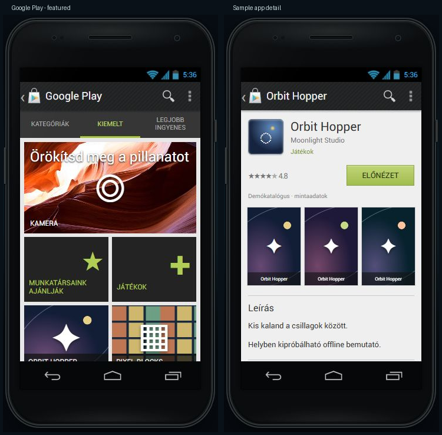

## Messaging reconstruction — 2026-09-29

Sources at AOSP tag `android-4.0.4_r2.1`:

- [Manifest](https://android.googlesource.com/platform/packages/apps/Mms/+/refs/tags/android-4.0.4_r2.1/AndroidManifest.xml) and [styles](https://android.googlesource.com/platform/packages/apps/Mms/+/refs/tags/android-4.0.4_r2.1/res/values/styles.xml): Holo.Light.DarkActionBar and the conversation list's split action bar on narrow screens.
- [Conversation list item](https://android.googlesource.com/platform/packages/apps/Mms/+/refs/tags/android-4.0.4_r2.1/res/layout/conversation_list_item.xml), [list menu](https://android.googlesource.com/platform/packages/apps/Mms/+/refs/tags/android-4.0.4_r2.1/res/menu/conversation_list_menu.xml), [compose layout](https://android.googlesource.com/platform/packages/apps/Mms/+/refs/tags/android-4.0.4_r2.1/res/layout/compose_message_activity.xml), and the sent/received row sources linked above.
- [Colors](https://android.googlesource.com/platform/packages/apps/Mms/+/refs/tags/android-4.0.4_r2.1/res/values/colors.xml), [dimensions](https://android.googlesource.com/platform/packages/apps/Mms/+/refs/tags/android-4.0.4_r2.1/res/values/dimens.xml) and `QuickContactDivot.java`: gray history background, white message blocks, 64dp square message avatars and the original small pointers over the avatars.

The floating compose button, round letter avatars and colored bubbles were replaced. Original compose/search/call/attachment/send icons and default contact pictures are included. Functional additions include recipient suggestions, arbitrary phone numbers, conversation search, persistent drafts, GSM/Unicode segment counts, sample picture attachments, forwarding, details, smileys and confirmed deletion. Existing numeric contact references and saved messages remain readable. Recents restores the nested message scroll container; desktop mouse dragging also scrolls it.

Browser checks covered draft persistence after reload, sending to an existing contact and a new phone number, invalid recipient handling, picture-only sending, message deletion, searching message text and returning to search, forwarding, Unicode counting, details, right-click options, simulated calling and returning through Recents. All five languages were checked at 390×650: translated input labels, no horizontal/document overflow, no broken images or logged browser errors. Unit checks cover segment boundaries, extended GSM characters, Unicode/emoji, contact normalization, legacy numeric/string thread references, draft sorting, search and HTML escaping.

Limits: menus expose a functional subset of Mms; attachments use the simulator's illustrated Gallery, and a tap also opens message options as a mouse/keyboard convenience. No group messages, real transport, delivery reports, video/audio attachments, contact photo editing or replica Android keyboard. Physical touch-device long-press and keyboard resizing were not tested. This is a source-informed browser approximation, not a pixel-exact Android rendering.

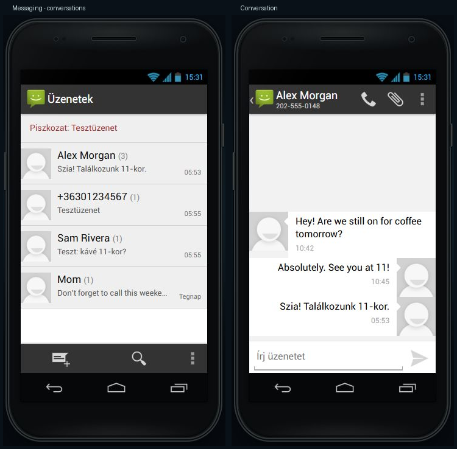

## People and Browser — 2026-09-29

Primary layout references at AOSP tag `android-4.0.4_r2.1`:

- [Contacts people_activity.xml](https://raw.githubusercontent.com/aosp-mirror/platform_packages_apps_contacts/android-4.0.4_r2.1/res/layout/people_activity.xml), [contact detail rows](https://raw.githubusercontent.com/aosp-mirror/platform_packages_apps_contacts/android-4.0.4_r2.1/res/layout/contact_detail_list_item.xml), and [photo header](https://raw.githubusercontent.com/aosp-mirror/platform_packages_apps_contacts/android-4.0.4_r2.1/res/layout/carousel_about_tab.xml).
- [Browser phone navigation bar](https://raw.githubusercontent.com/aosp-mirror/platform_packages_apps_browser/android-4.0.4_r2.1/res/layout/title_bar_nav.xml) and [tab card](https://raw.githubusercontent.com/aosp-mirror/platform_packages_apps_browser/android-4.0.4_r2.1/res/layout/nav_tab_view.xml).

People now uses a cyan header, three tabs, alphabetic white lists, original square placeholder photos, a photo detail header and a bottom action bar. Contacts can be searched, created, edited, starred and deleted; groups can be created and edited. Changes persist locally. Removing a contact preserves its messages under the phone number. The contact overflow menu exposes editing and deletion.

Browser uses the phone address bar, original tab/close icons, an overflow menu and a tab overview. Each tab has an independent navigation stack that persists across reloads. Bookmarks, history, saved sample pages and find-on-page highlighting work with the offline site collection. Two linked fictional articles were added. Saving a page stores a reference to bundled content, not a snapshot of an external website.

Checks: contact creation, editing, favorites and persistence; group creation, membership editing and persistence; independent browser histories, tab selection/closing and persistence; bookmarks and saved-page persistence; find-on-page counts and linked article navigation. Both apps were inspected at 390×650 in all five languages: no document/content horizontal overflow or broken images; browser error logs were empty. The contact editor was also visually checked at this size. Unit tests cover filtering, conversation retention, tab-history branching, closing and restore. JavaScript syntax and whitespace checks passed.

Remaining differences: People has a simplified favorites list, single phone/email fields, default photos and no Updates/account synchronization. Browser tab previews are text summaries rather than captured page thumbnails; menus expose a subset of the Android app. Font metrics, animation and browser rendering are approximations. Physical touch devices and their keyboards were not exercised.

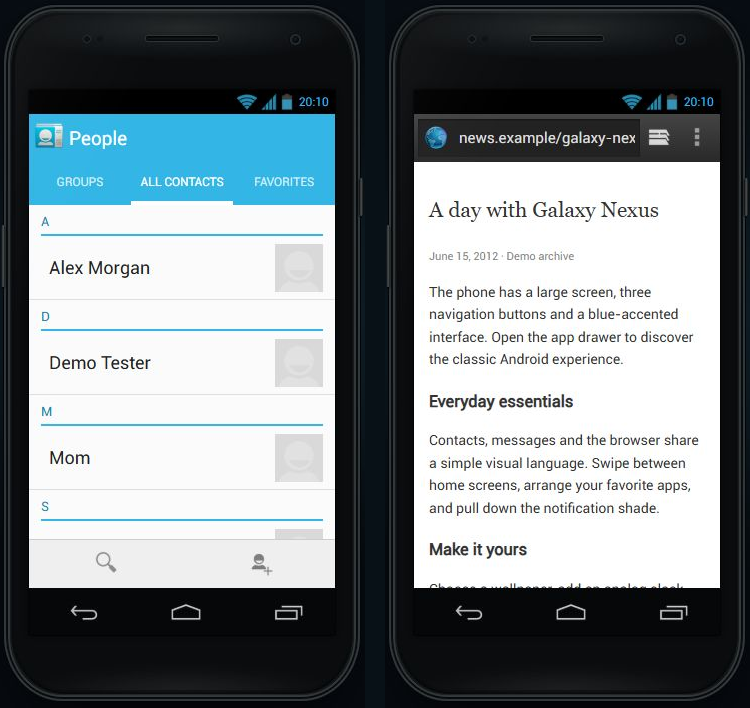

## DeskClock, favorites and browser previews — 2026-09-30

Sources were checked against `android-4.0.4_r2.1`, using the AOSP mirror when Gitiles was unavailable:

- [DeskClock layout](https://raw.githubusercontent.com/aosp-mirror-neo/platform_packages_apps_deskclock/android-4.0.4_r2.1/res/layout/desk_clock.xml), [time/date](https://raw.githubusercontent.com/aosp-mirror-neo/platform_packages_apps_deskclock/android-4.0.4_r2.1/res/layout/desk_clock_time_date.xml), [dimensions](https://raw.githubusercontent.com/aosp-mirror-neo/platform_packages_apps_deskclock/android-4.0.4_r2.1/res/values/dimens.xml) and [DeskClock.java](https://raw.githubusercontent.com/aosp-mirror-neo/platform_packages_apps_deskclock/android-4.0.4_r2.1/src/com/android/deskclock/DeskClock.java): right-aligned time/date over dimmed wallpaper, next-alarm entry and dimming.
- [Alarm list](https://raw.githubusercontent.com/aosp-mirror-neo/platform_packages_apps_deskclock/android-4.0.4_r2.1/res/layout/alarm_clock.xml), [alarm row](https://raw.githubusercontent.com/aosp-mirror-neo/platform_packages_apps_deskclock/android-4.0.4_r2.1/res/layout/alarm_time.xml), [editor](https://raw.githubusercontent.com/aosp-mirror-neo/platform_packages_apps_deskclock/android-4.0.4_r2.1/res/layout/set_alarm.xml) and [preferences](https://raw.githubusercontent.com/aosp-mirror-neo/platform_packages_apps_deskclock/android-4.0.4_r2.1/res/xml/alarm_prefs.xml): add row above the list, a separate left checkbox column, dark Holo preferences and bottom Cancel/Delete/OK actions.
- [Contacts favorite tile](https://raw.githubusercontent.com/aosp-mirror/platform_packages_apps_contacts/android-4.0.4_r2.1/res/layout/contact_tile_starred.xml): square photo and translucent bottom name strip.

The previous combined clock/alarm screen, white list, pill switches and floating add action were replaced. Original AndroidClock font and DeskClock icons are included. Existing saved alarms remain compatible. The editor supports time, repeat days, label, ringtone choice and vibration preference, with draft cancellation and confirmed deletion. A local scheduler displays an in-page alert, suppresses duplicate delivery in the same minute, disables completed one-shot alarms and supports ten-minute snoozing. The clock shows the next enabled occurrence.

People favorites now use photo tiles. Browser tab previews render the actual bundled page markup at reduced size; previews are inert and the outer card handles pointer/keyboard activation. These supersede the earlier simplified-favorites and text-preview limitations documented above.

Verified: create/edit/save an alarm with repeat days, label and ringtone, persistence after reload, cancel without changing the saved alarm, time decrement wrap, in-page alarm delivery and ten-minute snooze, and disabling the test alarm. A null-draft exception found during the delivery test was fixed and covered by a regression check. Tests cover legacy defaults, invalid times, weekday normalization, next-day/week rollover, snooze timing, duplicate suppression and HTML escaping. At 390×650, the alarm editor and repeat dialog were checked in all five languages without document/dialog overflow or broken images. Favorites and scaled browser previews were visually inspected.

Limits: ringtone/vibration are saved choices only; no sound or device vibration is emitted. Delivery runs only while this page is executing and is subject to browser timer throttling; it is not a real alarm service. The alert dialog and time spinner are browser approximations. Dock settings, a moving screensaver, volume/snooze-duration settings and Android's full alarm-notification behavior remain outside this implementation. Physical touch-device behavior was not tested.

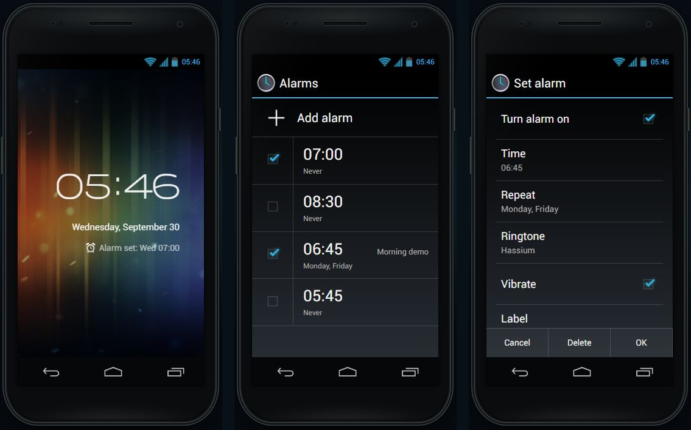

## Camera and Gallery — 2026-09-30

Primary references at `android-4.0.4_r2.1`:

- [Camera root](https://raw.githubusercontent.com/aosp-mirror/platform_packages_apps_camera/android-4.0.4_r2.1/res/layout/camera.xml), [control panel](https://raw.githubusercontent.com/aosp-mirror/platform_packages_apps_camera/android-4.0.4_r2.1/res/layout/camera_control.xml), [indicators](https://raw.githubusercontent.com/aosp-mirror/platform_packages_apps_camera/android-4.0.4_r2.1/res/layout/indicator_bar.xml), [dimensions](https://raw.githubusercontent.com/aosp-mirror/platform_packages_apps_camera/android-4.0.4_r2.1/res/values/dimens.xml) and [fullscreen theme](https://raw.githubusercontent.com/aosp-mirror/platform_packages_apps_camera/android-4.0.4_r2.1/res/values/styles.xml).
- Gallery2 [album-set menu](https://raw.githubusercontent.com/aosp-mirror-neo/platform_packages_apps_gallery2/android-4.0.4_r2.1/res/menu/albumset.xml), [album menu](https://raw.githubusercontent.com/aosp-mirror-neo/platform_packages_apps_gallery2/android-4.0.4_r2.1/res/menu/album.xml), [photo menu](https://raw.githubusercontent.com/aosp-mirror-neo/platform_packages_apps_gallery2/android-4.0.4_r2.1/res/menu/photo.xml) and [PhotoPage filmstrip](https://raw.githubusercontent.com/aosp-mirror-neo/platform_packages_apps_gallery2/android-4.0.4_r2.1/src/com/android/gallery3d/app/PhotoPage.java).

Camera now has the original blue shutter, textured 76dp control panel, review thumbnail and camera-setting icons. Its status bar is hidden as specified by ThemeCamera. Focus feedback, zoom, simulated front/back switching, exposure and white balance affect the illustrated capture; camera settings and captures persist. Flash cycles between auto/off/on as a stored simulation setting.

Gallery replaces the white grid with dark albums, an album image grid, a photo view and thumbnail filmstrip. Photo navigation supports arrow buttons, keyboard arrows and direct mouse/touch dragging. Zoom, three-second slideshow, persistent 90-degree rotation, details, confirmed deletion, wallpaper selection and sharing to a local Messaging draft are included. The same picture renderer is used for camera review, Gallery, wallpaper and new MMS attachments. Legacy photos are grouped without rewriting their saved records. Camera frames and example pictures are project-authored vector illustrations.

Checked in the browser: capture and review; front/back, white balance, exposure and zoom persistence; rotation/details; wallpaper selection; Messaging attachment handoff; mouse-drag photo navigation; automatic slideshow advancement and stopping; album/back navigation. At 390×650, Camera and Gallery were checked in EN/HU/DE/FR/ES: no document overflow, broken images or logged JavaScript errors. Tests cover legacy album grouping, scene/settings persistence, rotation, invalid-color filtering and escaping.

Limits: no physical camera, video/panorama, real flash, image import/export, crop editor, multi-selection or cloud albums. Zoom and focus are simplified. Gallery layout, transitions, photo toolbar visibility and image gestures approximate Android's OpenGL rendering. Touch-device/pinch behavior was not directly tested.

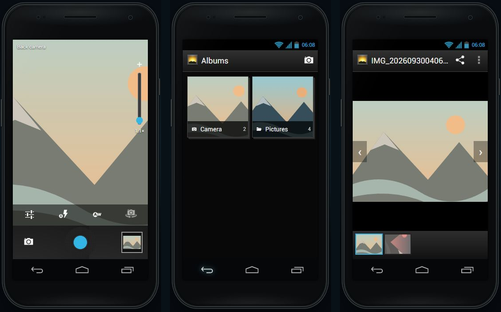

## Calendar — 2026-09-30

References from AOSP Calendar `android-4.0.4_r2.1`: [styles](https://raw.githubusercontent.com/aosp-mirror-neo/platform_packages_apps_calendar/android-4.0.4_r2.1/res/values/styles.xml), [colors](https://raw.githubusercontent.com/aosp-mirror-neo/platform_packages_apps_calendar/android-4.0.4_r2.1/res/values/colors.xml), [action menu](https://raw.githubusercontent.com/aosp-mirror-neo/platform_packages_apps_calendar/android-4.0.4_r2.1/res/menu/all_in_one_title_bar.xml), [full month](https://raw.githubusercontent.com/aosp-mirror-neo/platform_packages_apps_calendar/android-4.0.4_r2.1/res/layout/full_month_by_week.xml), [editor action bar](https://raw.githubusercontent.com/aosp-mirror-neo/platform_packages_apps_calendar/android-4.0.4_r2.1/res/layout/edit_event_custom_actionbar.xml) and [event details](https://raw.githubusercontent.com/aosp-mirror-neo/platform_packages_apps_calendar/android-4.0.4_r2.1/res/layout/event_info.xml).

The former generic month grid/floating add button is replaced by a Holo Light action bar, original Today/Discard/Save artwork, view selector, month busy indicators, 24-hour day/week timelines and an agenda. A local event editor supports location, notes, start/end dates and times, inclusive all-day ranges, validation, cancel and update. Search matches title, location and notes. Deletion requires confirmation. Existing date/time/title records remain compatible; the view preference persists.

Browser checks: create and reload an event, edit/discard without changing the saved title, invalid end-time rejection with retained input, location search, all-day multi-day creation, day/week rendering and horizontal mouse-drag navigation. At 390×650, all five language editors have no document or internal horizontal overflow, broken images or logged JavaScript errors. Unit checks cover leap day, week starts, midnight/year rollover, exclusive midnight timed endings versus inclusive all-day dates, overlap lane allocation, validation and escaping.

Limits: no recurrence, reminders, attendees, multiple calendars, account sync or custom time zones. Date/time inputs use browser pickers. The month busy markers and timed overlap geometry approximate Android's custom canvas views. Previous/next footer controls and horizontal month swipes are simulator conveniences; original month scrolling and animation physics are not reproduced. Physical touch-device behavior remains untested.

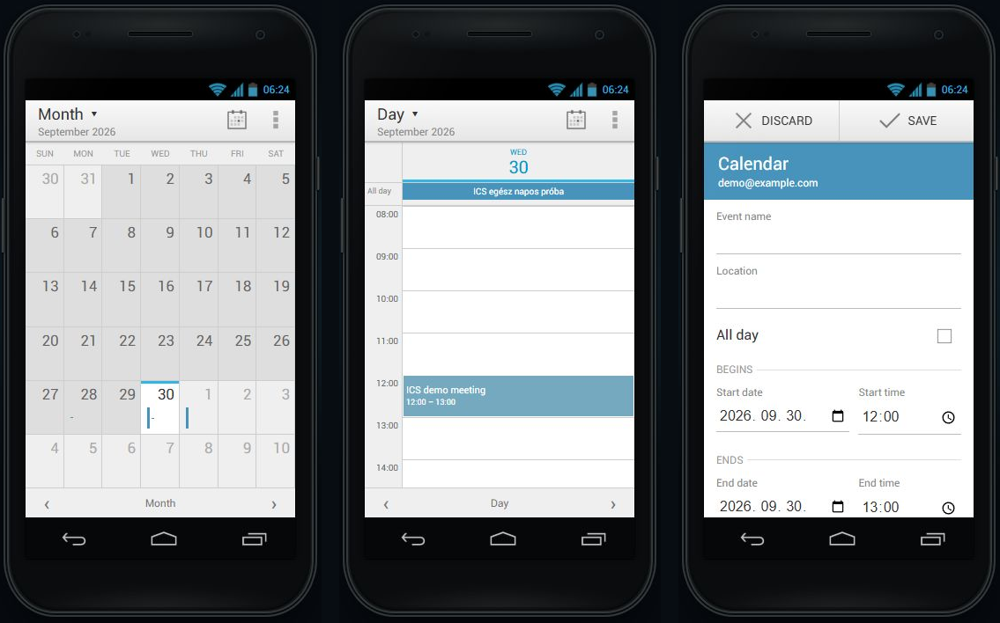

## AOSP Music — 2026-09-30

Sources: [library](https://raw.githubusercontent.com/aosp-mirror/platform_packages_apps_music/android-4.0.4_r2.1/res/layout/media_picker_activity.xml), [four tabs](https://raw.githubusercontent.com/aosp-mirror/platform_packages_apps_music/android-4.0.4_r2.1/res/layout/buttonbar.xml), [player](https://raw.githubusercontent.com/aosp-mirror/platform_packages_apps_music/android-4.0.4_r2.1/res/layout/audio_player.xml), [transport](https://raw.githubusercontent.com/aosp-mirror/platform_packages_apps_music/android-4.0.4_r2.1/res/layout/audio_player_common.xml), [now playing strip](https://raw.githubusercontent.com/aosp-mirror/platform_packages_apps_music/android-4.0.4_r2.1/res/layout/nowplaying.xml), and [manifest](https://raw.githubusercontent.com/aosp-mirror/platform_packages_apps_music/android-4.0.4_r2.1/AndroidManifest.xml). This is the stock open-source Music app with its older, pre-Holo appearance, not Google's separate proprietary Play Music app.

Replaced the generic music-note card with Artists/Albums/Songs/Playlists, original tabs/album placeholder/control images, a current queue, shuffle, repeat off/all/one, duration-based seeking and automatic track progression. Playlists support creation, adding and removing tracks. The home widget shares the same playback state. Track, position, queue, options and lists persist; reload resumes paused.

Verified in the browser: create a playlist from a song, view its count, switch songs, pause, seek and reload with options intact. Player checks in all five languages at 390×650 found no page overflow, missing images or logged errors. Model tests cover end-of-queue stopping, repeat, previous-track restart, shuffle avoiding the current song, malformed stored playlist IDs and escaping.

Limits: six fictional tracks and simulated elapsed time, without audio, file imports, cloud music or background media service. Queue reordering, playlist rename/delete and original long-press context menus remain absent. CSS approximates the legacy button backgrounds and seekbar; a visible library shortcut and per-song options buttons are simulator additions. Physical touch behavior was not tested.

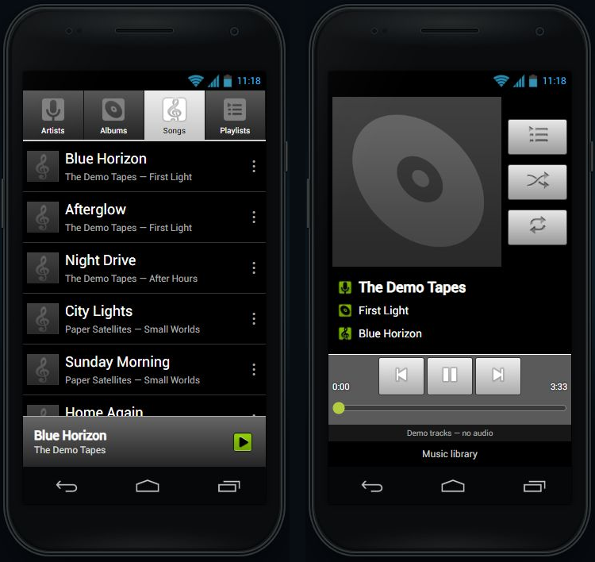

## Email — 2026-09-30

References: [message row](https://raw.githubusercontent.com/aosp-mirror-neo/platform_packages_apps_email/android-4.0.4_r2.1/res/layout/message_list_item_normal.xml), [styles](https://raw.githubusercontent.com/aosp-mirror-neo/platform_packages_apps_email/android-4.0.4_r2.1/res/values/styles.xml), [reader menu](https://raw.githubusercontent.com/aosp-mirror-neo/platform_packages_apps_email/android-4.0.4_r2.1/res/menu/message_view_fragment_option.xml) and [composer menu](https://raw.githubusercontent.com/aosp-mirror-neo/platform_packages_apps_email/android-4.0.4_r2.1/res/menu/message_compose_option.xml), tag `android-4.0.4_r2.1`.

Replaced letter avatars and the floating compose button with a light action bar, compact message rows, Holo checkboxes, original stars and toolbar artwork. Inbox/Starred/Drafts/Sent/Trash folders, selection, read/unread, search and recoverable trash use one persistent local mailbox. Old sent messages migrate without colliding with sample inbox IDs. Drafts autosave; reply uses the sample sender address. Forwarding preserves picture attachments. Cc/Bcc and comma/semicolon-separated recipient lists are validated. Sending is a local folder transition, with no network request. People email actions now use the same composer.

Browser checks: star and reply; invalid Cc rejection; autosaved body, recipients and picture surviving reload; simulated send; moving that test message to Trash and restoring it to Sent; forwarding its attachment. Reader checks in all five languages at 390×650 found no page overflow, missing images or logged errors. Model tests cover migration IDs, reply/forward addressing, recipients, recoverable trash, sending, search and escaping.

Limits: one fictional account, plain text bodies, one Gallery picture attachment per message, and no real mail transport, account wizard, reply-all, server sync, arbitrary files or HTML mail. Row geometry, split toolbar placement and selection animations are approximations. Physical touch behavior was not tested.

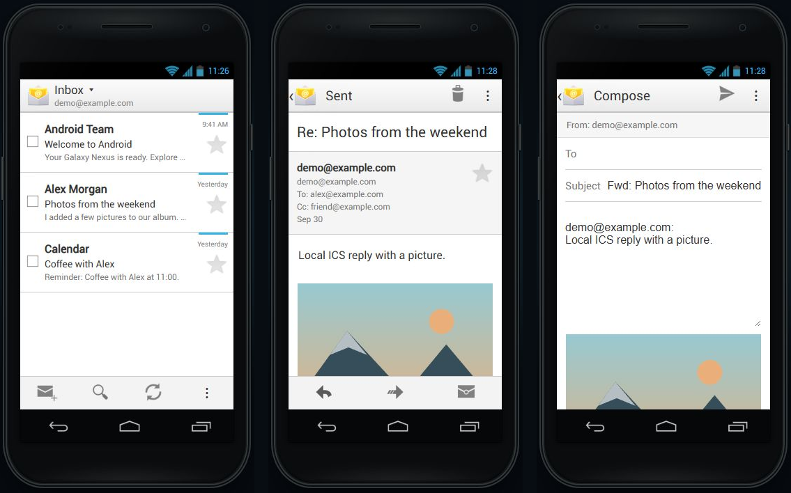

## Settings detail screens — 2026-09-30

Primary references: AOSP Settings [sound preferences](https://raw.githubusercontent.com/aosp-mirror/platform_packages_apps_settings/android-4.0.4_r2.1/res/xml/sound_settings.xml), [display preferences](https://raw.githubusercontent.com/aosp-mirror/platform_packages_apps_settings/android-4.0.4_r2.1/res/xml/display_settings.xml), [volume dialog](https://raw.githubusercontent.com/aosp-mirror/platform_packages_apps_settings/android-4.0.4_r2.1/res/layout/preference_dialog_ringervolume.xml), [app manager](https://raw.githubusercontent.com/aosp-mirror/platform_packages_apps_settings/android-4.0.4_r2.1/res/layout/manage_applications.xml) and [app details](https://raw.githubusercontent.com/aosp-mirror/platform_packages_apps_settings/android-4.0.4_r2.1/res/layout/installed_app_details.xml).

Sound/display placeholder text now opens saved volume, tone, silent-mode, font and sleep selections. Source-order touch feedback preferences are included. Idle locking uses the selected timeout while the document is visible; dialogs, active calls and drags defer it. All templates use original Holo checkboxes. Data usage includes cycles, mobile-data/limit controls, illustrative charts and per-app foreground/background counters. Storage links to Apps, Gallery and Music. Battery has history and use-detail screens. App management has Downloaded/Running/All tabs and details with disabled uninstall for bundled apps, simulated cache clearing, force stop, and confirmed reset of the selected app's local content. Full reset now initializes all new modules consistently.

Checked in the browser: touch-sound toggle, saved volume and ringtone, cache size changing to zero, app-clear confirmation/cancel, data cycle change, battery history, and automatic locking at 15 seconds (then restored to 30). Volume dialogs in EN/HU/DE/FR/ES at 390×650 have no document/dialog overflow, missing images or errors. All nine test files passed. Reset tests use synthetic data rather than clearing the browser's customized state.

Limits: storage, traffic, power and process figures are illustrative, not measured. Data-limit/background restrictions are stored simulation choices; there is no real network metering. Tone, feedback and volume settings do not emit sound/vibration. Pulse-light preference is stored only. No app packages are installed or uninstalled. App data clearing restores bundled demo data rather than Android filesystem semantics. Idle locking is subject to browser timer throttling. Charts, tabs, sliders and radio controls still approximate native drawing.

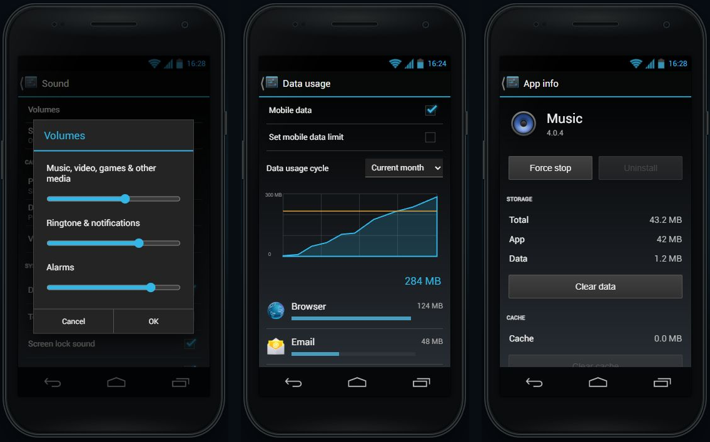

## Phone call screen and log — 2026-09-30

The in-call layout follows AOSP Phone [incall_touch_ui.xml](https://raw.githubusercontent.com/aosp-mirror/platform_packages_apps_phone/android-4.0.4_r2.1/res/layout/incall_touch_ui.xml), [call_card.xml](https://raw.githubusercontent.com/aosp-mirror/platform_packages_apps_phone/android-4.0.4_r2.1/res/layout/call_card.xml) and [colors.xml](https://raw.githubusercontent.com/aosp-mirror/platform_packages_apps_phone/android-4.0.4_r2.1/res/values/colors.xml): full contact placeholder, translucent top banner, blue state strip, full-width End call and five bottom controls. Original Phone drawables replace the old text controls.

A call simulates connection after 1.5 seconds, tracks elapsed time and keypad digits, and supports local speaker/mute/hold states. Home preserves the temporary call; an ongoing-call shade button returns to it. Hangup saves the outgoing record and duration; call details can redial or open the correct Messaging conversation. Favorites now use starred contacts in photo tiles above the full list. Reload retains call history but ends temporary calls.

Verified locally in the browser: outgoing call, timer, keypad, hold, mute, Home/notification return, hangup, persisted history after reload and call-to-message routing. Call details had no horizontal overflow or broken images at 390×650 in all five languages. `phone-call.test.cjs` covers timing, early hangup, duration, keypad, escaped contact names and recipient mapping. Screenshot: [Phone](screenshots/ics-phone.png).

Limits: no actual telephony/audio, incoming calls, conference call or Bluetooth audio routing. The ongoing notification is simplified. Photos use the original unknown-contact placeholder, and the call-details layout remains an approximation. Speaker/mute/hold are demo states only.

## System settings follow-up — 2026-09-30

Source references: AOSP Settings [date_time_prefs.xml](https://raw.githubusercontent.com/aosp-mirror/platform_packages_apps_settings/android-4.0.4_r2.1/res/xml/date_time_prefs.xml), [tether_prefs.xml](https://raw.githubusercontent.com/aosp-mirror/platform_packages_apps_settings/android-4.0.4_r2.1/res/xml/tether_prefs.xml), [security_settings_chooser.xml](https://raw.githubusercontent.com/aosp-mirror/platform_packages_apps_settings/android-4.0.4_r2.1/res/xml/security_settings_chooser.xml), [wifi_ap_dialog.xml](https://raw.githubusercontent.com/aosp-mirror/platform_packages_apps_settings/android-4.0.4_r2.1/res/layout/wifi_ap_dialog.xml) and [vpn_dialog.xml](https://raw.githubusercontent.com/aosp-mirror/platform_packages_apps_settings/android-4.0.4_r2.1/res/layout/vpn_dialog.xml), all from `android-4.0.4_r2.1`.

- Date/time now follows the original preference order: automatic time, automatic zone, date, time, zone, 24-hour format and date format. Manual controls disable while automatic mode is active. Stored time offsets keep ticking across reloads. IANA time zones support daylight-saving changes; nonexistent local times are rejected. The simulated wall clock feeds status/lock/widget clocks, DeskClock, alarm checks and Calendar's today marker.
- Security adds saved owner text and None/Slide selection. None turns the simulated display black; tap or Power wakes it without a slide gesture. Slide retains the existing lock ring. At this stage, Face, pattern, PIN, password and encryption were disabled; the credential-screen follow-up below supersedes the pattern/PIN/password limitation.
- Tethering has the original row sequence and a hotspot name/security/password dialog. Validation preserves entered values. Enabling the hotspot disables simulated Wi-Fi, and enabling Wi-Fi disables the hotspot. Bluetooth tethering enables Bluetooth; airplane mode clears tethering states. USB is disabled because the simulation has no USB connection.
- VPN supports persistent named/type/server profiles, editing, confirmed deletion and a temporary connected/disconnected demo state. Username/password input is not stored and no request is sent. The editor intentionally exposes only basic profile fields.
- Mobile networks adds APN list, selection and editing (name/APN/MCC/MNC), confirmed deletion, 2G preference and dummy operator search/registration. The selected carrier also appears in the shade and lock screen. Wi-Fi advanced has a saved sleep choice and illustrative MAC/IP values.

Browser checks: manual clock and 12-hour display, time persistence, hotspot validation and persistence, local VPN connect, profile-delete cancellation, APN persistence/selection, owner text, None sleep/wake, Slide restoration, Wi-Fi sleep selection and no console errors. Hotspot dialogs showed no horizontal overflow or broken images at 390×650 in EN/HU/DE/FR/ES. All eleven Node test files passed, including time/DST, profile validation, profile deletion and existing app regressions. Screenshot: [system preferences](screenshots/ics-system-settings.png).

Limits at this stage: browser-native date/time/select fields; only None/Slide locking (extended below); limited time-zone and network lists; no real networking, encryption, SIM provisioning or hardware management. VPN/APN editors omit many original advanced fields. Wi-Fi sleep/2G preferences are stored demo values. Existing messages and call-log timestamps retain their browser-clock timestamps. Row metrics, modal sizing and disabled-state behavior remain browser approximations.

## Launcher folders — 2026-10-01

Primary references: Launcher2 [Folder.java](https://android.googlesource.com/platform/packages/apps/Launcher2/+/android-4.0.4_r2.1/src/com/android/launcher2/Folder.java), [FolderIcon.java](https://android.googlesource.com/platform/packages/apps/Launcher2/+/android-4.0.4_r2.1/src/com/android/launcher2/FolderIcon.java), [user_folder.xml](https://android.googlesource.com/platform/packages/apps/Launcher2/+/android-4.0.4_r2.1/res/layout/user_folder.xml), [dimensions](https://android.googlesource.com/platform/packages/apps/Launcher2/+/android-4.0.4_r2.1/res/values/dimens.xml) and [configuration](https://android.googlesource.com/platform/packages/apps/Launcher2/+/android-4.0.4_r2.1/res/values/config.xml).

- Dragging one shortcut onto another creates a folder on the workspace or dock. Drawer items copy into folders, while workspace/folder items move. Existing Google shortcuts migrate into editable folders without changing neighboring icons.
- The icon uses original circular artwork and a three-item perspective stack. Opening uses the original dark container asset, an adaptive grid with 74 × 82 cells, and an editable cyan name below the icons. The panel stays inside the simulated display and near its icon.
- Folders accept up to 16 shortcuts. Icons can be reordered or extracted; a folder with one remaining item dissolves into that shortcut. Failed/full/nested-folder drops retain the source. Whole folders move between the workspace and dock and can be removed as shortcuts.
- Names, contents and positions persist in localStorage. Custom names are excluded from automatic translation. Hovering a folder while dragging opens it; leaving it closes it after a delay.

Browser checks: workspace and dock creation, renaming, internal reorder, extraction, automatic dissolution, reload persistence and copying a drawer app into an existing folder. At 390 × 650, all five languages showed translated folder controls, preserved the custom name `Music`, and had no document overflow, missing images or console errors. All twelve Node test files passed; folder model checks include full-folder and nested-folder rejection without source loss, migration, dock movement and removal.

Limits: the browser approximates nine-patch rendering, perspective stacking, open/drop/reorder animation and keyboard behavior. The neighboring icons do not animate aside during folder reorder; the target is highlighted and the order changes on release. Physical touchscreen long-press behavior and delayed hover opening were not automated. Folder names are limited to 40 characters. These checks do not establish pixel-perfect fidelity across the rest of the simulator.

## Credential screens — 2026-10-01

Primary references, all at `android-4.0.4_r2.1`: framework [pattern unlock layout](https://android.googlesource.com/platform/frameworks/base/+/android-4.0.4_r2.1/core/res/res/layout/keyguard_screen_unlock_portrait.xml), [password/PIN unlock layout](https://android.googlesource.com/platform/frameworks/base/+/android-4.0.4_r2.1/core/res/res/layout/keyguard_screen_password_portrait.xml), [numeric keyboard](https://android.googlesource.com/platform/frameworks/base/+/android-4.0.4_r2.1/core/res/res/xml/password_kbd_numeric.xml), [LockPatternView.java](https://android.googlesource.com/platform/frameworks/base/+/android-4.0.4_r2.1/core/java/com/android/internal/widget/LockPatternView.java), Settings [pattern setup](https://android.googlesource.com/platform/packages/apps/Settings/+/android-4.0.4_r2.1/res/layout/choose_lock_pattern.xml) and [ChooseLockPassword.java](https://android.googlesource.com/platform/packages/apps/Settings/+/android-4.0.4_r2.1/src/com/android/settings/ChooseLockPassword.java).

- Pattern, PIN and Password now have full-screen setup and confirmation. Changing or removing a configured lock requires its current credential. Cancel preserves the previous lock. Face Unlock stays disabled.
- Patterns use original point/ring assets, a continuous pointer path, midpoint insertion, no repeated dots, at least four dots and optional hidden traces. Keyboard users can activate dot buttons and the Unlock action. PIN uses the original 3-column arrangement, including the double-width zero and OK key. Password includes a local QWERTY keyboard, shift and symbol switching, plus physical-keyboard input.
- The selected method and a randomly salted SHA-256 digest persist; plaintext credentials do not. Reload starts at the configured lock. Power cycles the locked display without unlocking; Home, Recents and notification entry cannot open apps while locked. Five incorrect attempts trigger a persistent 30-second retry delay. Short incomplete patterns do not count toward it. Back/Cancel and in-page alarms remain usable without unlocking apps.
- Pattern/PIN/password controls, validation and error messages are translated into all five languages. The setup explains that these are test credentials for a local simulator. HTTPS/localhost is needed for Web Crypto.

Browser checks: short PIN rejection; mismatched confirmation and correction; PIN save, wrong/correct unlock, Power/Home/reload retention, five-failure retry delay surviving reload; old-code verification before mode changes; actual pointer drawing with automatic middle-dot selection and rejection of a three-dot pattern; pattern confirmation and unlock using keyboard-accessible dots; password validation, on-screen typing, save, wrong/correct unlock; cancelled replacement preserving the old pattern; return to Slide. Password lock screens at 390 × 650 in EN/HU/DE/FR/ES and at 320 × 568 had no horizontal or credential-content overflow, missing images or console errors. All thirteen Node test files passed, including pattern jumps, credential validation/matching, salted storage, reload and retry deadlines.

Limits: this is a simulation, not access control or encryption for browser data. Header reset and browser storage controls remain available. No Face Unlock, account recovery, real emergency calls, Android input-method switching, haptics, policy-managed passwords or encryption. Key backgrounds, clock/field metrics, pattern arrows and transitions are approximations. Password entry stays masked regardless of the global show-password-characters preference. The QWERTY keyboard has a limited symbol page. Physical-device multi-segment touch drawing and operating-system keyboard interactions were not tested; browser pointer strokes, keyboard pattern input and model transitions were checked.

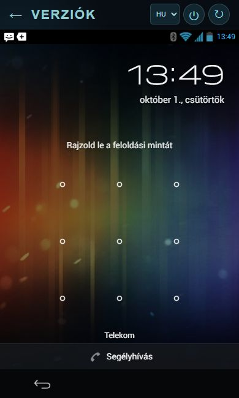

